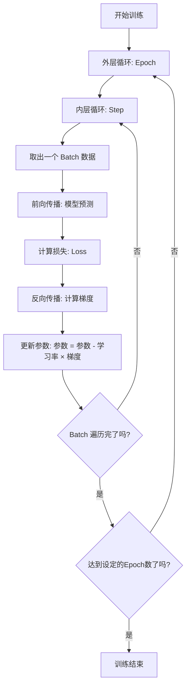

这几个概念是深度学习的核心训练机制，我通过一个生动的比喻和具体示例，一次性讲清楚它们的关系。

### 🎓 核心比喻：背单词书

- **Epoch (轮次)**：把整本单词书从头到尾背一遍，就是1个epoch。
- **Batch (批次)**：你无法一次性背完整本书，所以把书分成若干小份，每次背一小份。这一小份就是一个batch。
- **Step (步数)/Iteration (迭代)**：你每背完一小份（一个batch），就完成了一个step。

### 📊 关系和计算

假设我们有 **1000个训练样本**，设定 **Batch Size = 100**。

| 概念 | 计算 | 本例中的值 | 比喻解释 |
| :--- | :--- | :--- | :--- |
| **Batch Size** | (你自己设定) | **100** | 你决定每次背100个单词 |
| **Batches Per Epoch** | `总样本数 / Batch Size` | `1000 / 100 = 10` | 把单词书分成了10份 |
| **1 Epoch** | `Batches Per Epoch 个 Steps` | **10 Steps** | 完成1个Epoch需要背完这10份 |
| **1 Step** | `1个 Batch 的训练` | `处理100个样本` | 背完一份单词的过程 |

**核心计算关系：**
`1 Epoch = (总样本数 ÷ Batch Size) 个 Steps`

### ⚙️ 核心运作机制：在1个Step中发生了什么

在每一个step里，学习率和损失函数紧密配合，完成一次模型的参数更新。

1.  **准备数据**：从训练集中取出一个batch的数据（100个样本）。
2.  **前向传播**：让模型对这100个样本进行预测。
3.  **计算损失 (Loss)**：使用**损失函数**，计算模型预测结果和真实答案之间的差距。这个差距就是**损失**，它是一个标量，衡量模型当前的表现有多差。
4.  **反向传播**：计算损失值相对于模型中每一个参数的梯度。这个梯度告诉我们，如何调整每个参数才能最快地减小损失。
5.  **更新参数**：优化器（如Adam）根据计算出的梯度和我们设定的**学习率 (Learning Rate)** 来更新模型的参数。
    - **公式**：`新参数 = 旧参数 - 学习率 × 梯度`
    - **学习率的作用**：它控制着参数更新的**步长**。学习率太大，可能一步跨过最优解（导致震荡）；学习率太小，收敛速度会很慢。

这个“**计算损失 → 计算梯度 → 更新参数**”的闭环，就发生在一个step内。

### 🔄 宏观训练循环：它们是如何串起来的

下面这个简化的代码逻辑展示了整个训练过程：

```python
# 超参数设定
learning_rate = 0.001  # 学习率
num_epochs = 10        # 总训练轮数
batch_size = 64        # 批次大小

model = MyModel()
optimizer = Adam(model.parameters(), lr=learning_rate)
loss_fn = CrossEntropyLoss()

# 外层循环：Epoch
for epoch in range(num_epochs):
    print(f"Epoch {epoch+1} / {num_epochs}")
    
    # 内层循环：Step (遍历每个Batch)
    for step, (inputs, labels) in enumerate(train_loader):
        
        # 1. 前向传播
        predictions = model(inputs)
        
        # 2. 计算损失 (Loss)
        loss = loss_fn(predictions, labels)
        
        # 3. 反向传播 & 参数更新
        optimizer.zero_grad()  # 清空上一次的梯度
        loss.backward()        # 计算当前梯度
        optimizer.step()       # 根据梯度和学习率更新参数
        
        # 每隔一定步数打印信息
        if step % 100 == 0:
            print(f"  Step {step}, Loss: {loss.item():.4f}")
```

- **Epoch控制全局**：决定了整个训练过程要“背单词书”多少遍。
- **Step构成Epoch**：每个epoch由许多step组成，每个step处理一个batch。
- **Loss是指挥棒**：在每个step内，loss的值提供了优化的方向。
- **学习率是调节阀**：在每个step内，它决定了根据loss的指引，我们要对模型参数做多大的调整。

### 📈 总结与关系图

我用一个极简图来总结它们的关系和作用链：



### 🎯 一句话总结

**Epoch**定义了整体训练的“**次数**”，**Batch**定义了每次学习所用的“**样本量**”，**Step**是执行一次参数更新的“**动作**”，**损失(Loss)** 提供了优化“**方向**”，而**学习率**则控制了向正确方向迈进的“**步长**”。整个训练过程就是在一个个Epoch中，通过无数个Step，根据Loss的指引和学习率的大小，不断地调整模型参数，直到模型表现最好。