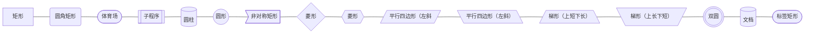
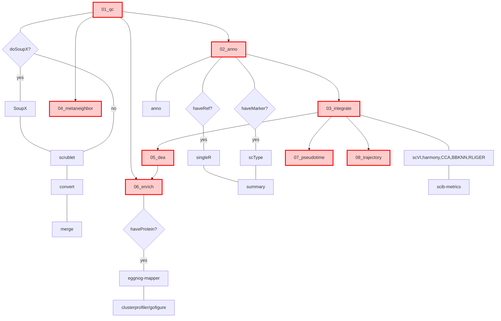

| 主形状       | 可用括号写法     | 说明 / 别名             |
| --------- | ---------- | ------------------- |
| 矩形        | `[文本]`     | 默认矩形                |
| 圆角矩形      | `(文本)`     | rounded rectangle   |
| 体育场       | `([文本])`   | stadium（大圆弧两端）      |
| 子程序       | `[[文本]]`   | subroutine（双框矩形）    |
| 圆柱        | `[(文本)]`   | cylinder（数据库图标）     |
| 圆形        | `((文本))`   | circle              |
| 非对称矩形     | `>文本]`     | asymmetric（右侧直切）    |
| 菱形        | `{文本}`     | decision / 条件判断     |
| 六角形       | `{{文本}}`   | hexagon             |
| 平行四边形（左斜） | `[/文本/]`   | parallelogram       |
| 平行四边形（右斜） | `[\文本\]`   | parallelogram-alt   |
| 梯形（上短下长）  | `[/文本\]`   | trapezoid           |
| 梯形（上长下短）  | `[\文本/]`   | trapezoid-alt       |
| 双圆        | `(((文本)))` | double-circle（停止节点） |
| 文档        | `[(文本)]`   | document（同圆柱，但语义不同） |
| 标签矩形      | `([文本])`   | tagged-rectangle    |



| 场景    | 写法                         | 效果     |
| ----- | -------------------------- | ------ |
| 直线无箭头 | `A --- B`                  | 无箭头    |
| 虚线无箭头 | `A -.- B` 或 `A -. 描述 .- B` | 虚线+无箭头 |
| 粗线无箭头 | `A == B` 或 `A == 描述 == B`  | 粗线+无箭头 |

| 关键字         | 方向               | 示例             |
| ----------- | ---------------- | -------------- |
| `TB` / `TD` | Top→Bottom（↓）默认  | `flowchart TB` |
| `BT`        | Bottom→Top（↑）    | `flowchart BT` |
| `LR`        | Left→Right（→）最常用 | `flowchart LR` |
| `RL`        | Right→Left（←）    | `flowchart RL` |

颜色
```
classDef mainNode fill:#ffcccc,stroke:#ff0000,stroke-width:3px
class A,B,C,D,E,F,H mainNode
linkStyle 4 stroke:#ff0000,stroke-width:3px
linkStyle 11 stroke:#ff0000,stroke-width:3px
linkStyle 16 stroke:#ff0000,stroke-width:3px
linkStyle 20 stroke:#ff0000,stroke-width:3px
linkStyle 21 stroke:#ff0000,stroke-width:3px
linkStyle 22 stroke:#ff0000,stroke-width:3px
```

