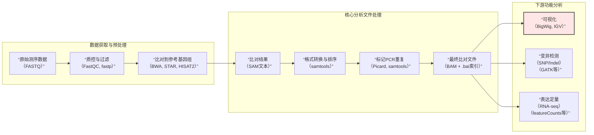

好的，我们来深入拆解BAM文件。它是连接原始测序数据和下游分析的核心枢纽，理解了它，整个分析链路就清晰了。

### 1. BAM文件是什么？

BAM是**SAM**文件的**二进制压缩版**，全称是 Binary Alignment/Map。它专门用来存储测序序列（reads）比对到参考基因组上的结果。

为了方便你理解，不妨记住这两点：

-   **SAM文件**：纯文本，可以直接用文本编辑器打开查看，但体积巨大。
-   **BAM文件**：SAM的压缩二进制版本，占用空间小，并且会**建立索引**（生成`.bai`文件），所以能支持快速随机访问。比如你想看某个基因区域的比对情况，计算机会直接跳到那个位置读取，不用扫描整个文件。

### 2. BAM文件如何获取？

BAM文件不是测序仪直接产出的。从测序原始数据到BAM，有标准流程，简单来说就是：**测序 → 评估质控 → 比对 → 格式转换与排序 → 标记重复**。

#### 第一步：测序仪下机数据
测序仪得到的原始数据是**FASTQ**格式。它记录了两项核心信息：

-   **序列信息**：每一条read的碱基序列（A, T, C, G）。
-   **质量信息**：每个碱基被正确测序的概率，用ASCII码表示。

比如一条典型的Illumina测序read长这样：
```
@SEQ_ID
GATTTGGGGTTCAAAGCAGTATCGATCAA...
+
!''*((((***+))%%%++)(%%%%).1***-+*''))
```

#### 第二步：序列比对
这是最关键的一步，原理是把FASTQ文件里的上千万条短序列，通过比对算法在参考基因组上找到它们的“原始位置”。常用工具有：

-   **DNA数据**：**BWA**, Bowtie2
-   **RNA数据**：**STAR**, HISAT2（它们能跨内含子比对，这是RNA-seq与DNA-seq的根本区别）

#### 第三步：格式转换、排序、标记重复
比对后得到的SAM文件需要进一步加工，才能成为标准可用的BAM：

1.  **SAM转BAM并排序**：
    -   转换：`samtools view -bS input.sam > output.bam`
    -   排序：`samtools sort`。排序是按染色体坐标排序，这是所有后续操作的基础。
2.  **标记PCR重复**：
    -   用 `Picard MarkDuplicates` 或 `samtools markdup`。这不是删除重复，而是在文件里打个标签，告诉下游工具“这些是重复”，分析时会忽略它们，避免PCR扩增偏差。
3.  **建索引**：
    -   用 `samtools index` 为最终的BAM文件构建索引，生成`.bai`文件。IGV等浏览器快速显示某个区域，依赖的就是这个索引。

### 3. BAM文件里有什么？

一个标准的BAM文件包含**头部信息**和**比对记录**两部分，每一行都是一条read的比对结果。

#### 头部信息
以 `@` 开头，包含文件的元数据：

-   `@HD`：文件版本、排序方式。
-   `@SQ`：参考序列名称（如`chr1`）和长度，很重要，缺失会导致很多工具报错。
-   `@RG`：读组信息，用于区分不同样本，GATK流程必须要有。
-   `@PG`：处理过程记录，记录了每一步用了什么软件。

#### 比对记录
主体部分，每行11列必选字段，核心的几个如下：

-   **QNAME**：Read的名称。
-   **FLAG**：一个数字，概括了比对情况（如是否比对到正链、是否重复），可以用工具解码。
-   **RNAME**：比对上的参考序列名。
-   **POS**：最左端比对位置（1-based）。
-   **MAPQ**：比对质量值，越高越可靠。
-   **CIGAR**：一个字符串，精确定义了比对细节（`M`匹配，`I`插入，`D`缺失，`N`内含子）。
-   **SEQ**：Read的碱基序列。
-   **QUAL**：碱基质量值。

此外，还有可选的标签（TAG），如 `NM:i` 记录了该read的错配碱基数。

### 4. BAM文件的作用与核心操作

BAM文件是你的**分析原材料**，几乎所有变异检测和定量分析都基于它。

**核心操作：**
1.  **查看内容**：永远不要直接`cat` BAM文件。用 `samtools view input.bam | less` 查看可读部分。
2.  **区域提取**：`samtools view input.bam chr1:10000-20000`，精确提取并查看特定区域。
3.  **统计与质控**：`samtools flagstat` 快速看比对率等关键指标。
4.  **生成BigWig**：你最初问题的核心。就是用 `deeptools` 的 `bamCoverage` 命令，将BAM转换成BigWig，用于可视化。
5.  **变异检测**：GATK流程核心输入，用于找SNP/Indel。
6.  **表达定量**：HTSeq-count或featureCounts的输入，用于数每个基因上的reads数。

### 5. 你的生信分析流程全貌

现在，我们把整个过程串起来，就形成了基因组数据分析的标准管线：



理解这条链路，你就掌握了高通量测序数据分析的主干。如果你想动手试试哪一步，比如具体怎么用 `fastp` 做质控，或者 `STAR` 做比对，我可以给你整理一份可直接上手的命令行示例。