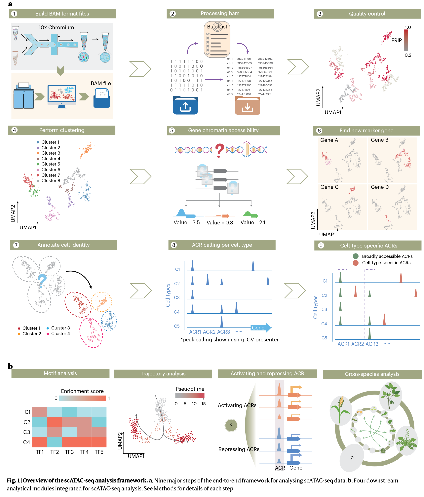
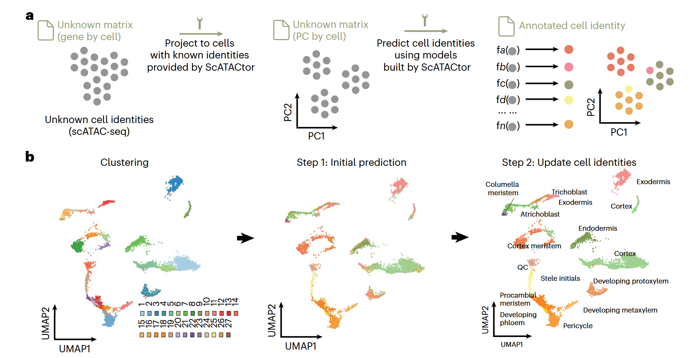

- atac analysis pipeline [1]

## scATAC annotation
- scATACtor [html](https://htmlpreview.github.io/?https://github.com/yanhaidong1/Socrates2/blob/main/vignettes/annotate_cell_identity.html)

## references
1. 2026 NP Single-cell chromatin accessibility and cis-regulatory element analyses in plants using the scPlantReg platform