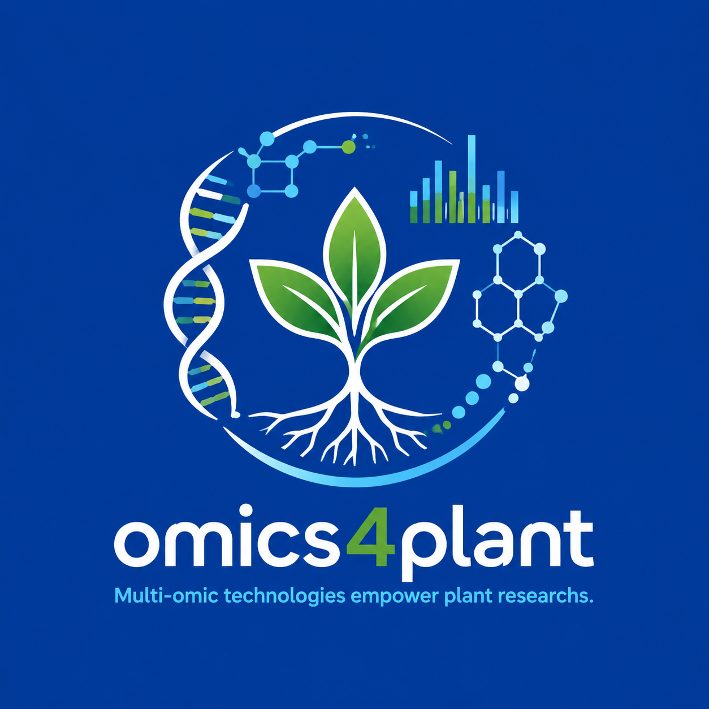

 

<!-- badges: start -->
<!-- badges: end -->

# omics4plant

 

---

> - [CS](./CS/): Basic programing language and algorithm.
> - [DATABASE](./DATABASE/): Genetic/evolutionary/morphological databases.
> - [NOTE](./NOTE): My learning records, thinking, enjoy and sharing.
> - [PLANT](./PLANT/): Diverse orgnanism about life tree of plant(taxonomy, evolution), cultivated species(rice, maize), model species(at) et al.
> - [PLOT](./PLOT/): Scientific drawing, beautiful plots not only attract others attention but only happy myself.
> - ~~[PROJECT](./PROJECT/): Projects, Works, Tasks, and Logs.~~
> - [PROJECT-open](./PROJECT-open/): Opened project, friendly source.
> - [SOFTWARE](./SOFTWARE/): Softwares & Packages.
> - [TECHNOLOGY](./TECHNOLOGY/): Advance techs including omics, sequence, biochemistry, physiology.
> - [TRAIN](./TRAIN/): Some trainings, systematic collection and teach.
> - [WORKFLOW](./WORKFLOW/): Analysis pipelines and buiding in DCS cloud.

---

## Workflows' tutorial content
> [workflow list]()
- [Enrich](./WORKFLOW/Enrich/README.md)

## Contributors
- ydgenomics
- Bioer-yd

## ToDo

 
 todo 

- 学习R包reticulate
- **develop a utlis packages in R and python (ydutils)**
  - Why we need a utils package?
  - A utils package how to fasten our works?
  - How to develop a package? not is all from AI.
- **anatomy: plant cell types**

## Q&A

 
 Q&A 

- **算法：AUC**

## Tips

 
 Tips 

> 多提问，善于提问
- 每周精读一篇英文文献
- 每周文献提问尝试提一个有意义的问题
- 每日英语学习（不背单词/Nature profile/quick reading）
- 每日纸质书阅读
- 每日健康作息（好好睡觉&好好吃饭&锻炼&大脑放松）

