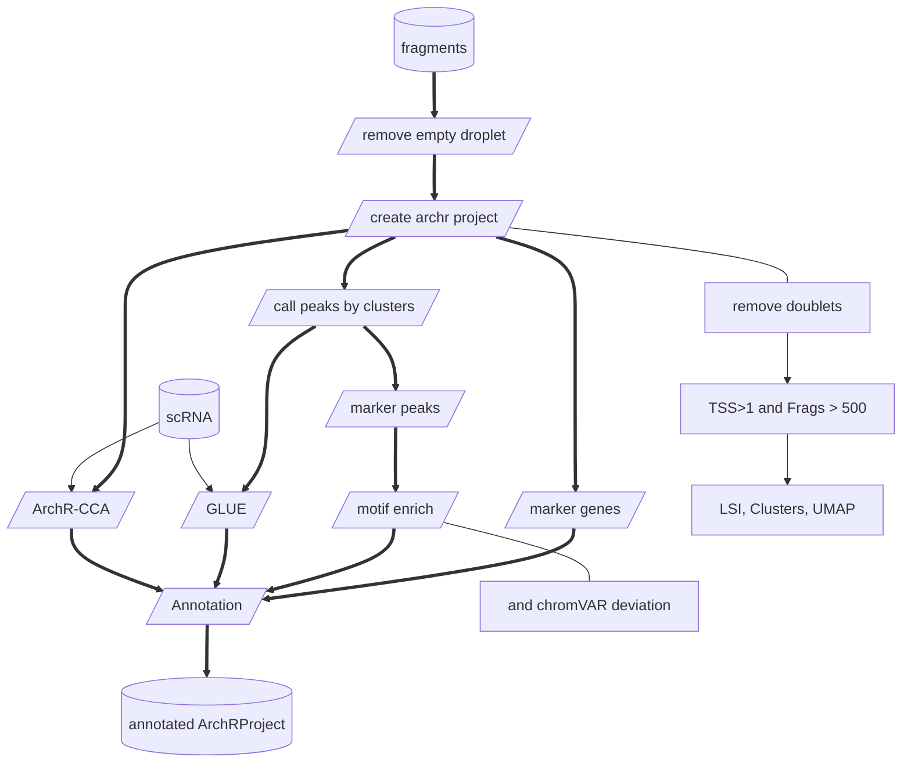
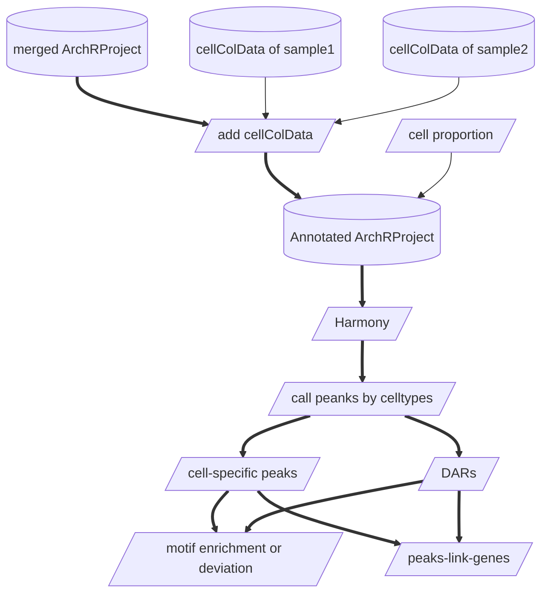

# [ArchR](https://www.archrproject.com/bookdown/index.html)

1. 什么是scATAC-seq
2. ArchR的ArchRProject对象
3. 质控（去双胞和低质量的细胞）
4. 构建ArchRProject对象
5. 降维(LSI)/去批次(harmony)
6. 聚类
7. embedding可视化（UMAP/tSNE）
8. 标记基因与基因得分
9. 细胞类型注释（CCA/GLUE）
10. 获得peak Matrix（macs2）
11. 标记peaks
12. motif富集（序列相似性）
13. chromVAR deviation富集
14. 足迹分析
15. peak关联基因（co-accessibility, peakLinkGene, TF-regulons）
16. 轨迹分析

## ArchRProject对象
- `getAvailableMatrices(projHeme2)`: TileMatrix, GeneScoreMatrix, PeakMatrix, MotifMatrix

## GeneScoreMatrix
- 注释：heatmap, dotplot, ModuleScores
- correlation (ATAC with RNA)

## PeakMatrix
- call peak的不同方法的不同
- 先对clusters做call peaks拿到PeakMatrix用于GLUE的整合注释
- 注释完之后做差异peak
- 差异peak做motif富集和deviation富集
- 做co-accessibility和peakLinkgene，将差异peak变成基因
- cCARs细胞类型特异开放区

## Annotation (accuracy and match with RNA)
- GLUE & ArchR
- cell-specific genes
- cell-specific peaks (*Nature plants, 2025*)
- correlation between different samples (*Integration with multi-samples* / pearman)
- cell-specific motif enrichment

## GRN for unpaired scATAC and scRNA
- pySCENIC
- SCENIC+