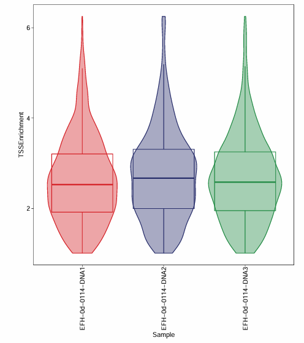
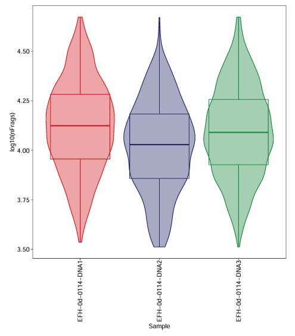

# ArchR analysis
> 当你选择使用ArchR做下游分析时，最好看看你的gtf基因名格式，如果存在_，建议全部更换为-后做下游分析，如果你还是用的Seurat做的RNA的分析的话，更需要注意这个问题

## region_annotation

## remove_empty_droplet
> 移除空液滴。单细胞测序仅保留自动化流程判定为细胞的barcode
- **script**: [1_remove_empty_droplet.R](../ArchR/1_remove_empty_droplet.R)
- **input**: 自动化流程输出的output目录
  - three files in output directory: fragments.tsv.gz & fragments.tsv.gz.tbi; singlecell.csv; metrics_summary.xls; 
  - tree of "output"
    ```shell
    $ tree /Files/User/huangpeilin/HuBeiNongKeYuan_rice_embryo/ATAC/EFH-0d-0114-DNA1/EFH-0d-0114-DNA1/output/
    /Files/User/huangpeilin/HuBeiNongKeYuan_rice_embryo/ATAC/EFH-0d-0114-DNA1/EFH-0d-0114-DNA1/output/
    ├── EFH-0d-0114-DNA1_scATAC_report.html
    ├── filter_peak_matrix
    │   ├── barcodes.tsv.gz
    │   ├── matrix.mtx.gz
    │   └── peaks.bed.gz
    ├── fragments.tsv.gz
    ├── fragments.tsv.gz.tbi
    ├── metrics_summary.xls
    ├── raw_peak_matrix
    │   ├── barcodes.tsv.gz
    │   ├── matrix.mtx.gz
    │   └── peaks.bed.gz
    └── singlecell.csv

    3 directories, 11 files
    ```
- **output**:
  ```shell
  $ tree -L 2 ./out/EFH-0d-frags
  ./out/EFH-0d-frags
  ├── EFH-0d-0114-DNA1_fragments_filtered.tsv.gz
  ├── EFH-0d-0114-DNA1_fragments_filtered.tsv.gz.tbi
  ├── EFH-0d-0114-DNA2_fragments_filtered.tsv.gz
  ├── EFH-0d-0114-DNA2_fragments_filtered.tsv.gz.tbi
  ├── EFH-0d-0114-DNA3_fragments_filtered.tsv.gz
  └── EFH-0d-0114-DNA3_fragments_filtered.tsv.gz.tbi

  1 directory, 6 files
  ```

<details> <summary> details </summary>

- ./{prefix}/*_fragments_filtered.tsv.gz
- ./{prefix}/*_fragments_filtered.tsv.gz.tbi
- all_metrics_summary.csv
  > 重点关注：Median.fragments.per.cell；Median.fraction.of.fragments.overlapping.TSS；
  ```R
  > df <- read.csv('all_metrics_summary.csv')
  > df
          SampleName   Species Estimated.number.of.cells
  1 EFH-0d-0114-DNA1 rice_atac                     5,451
  2 EFH-0d-0114-DNA2 rice_atac                     6,602
  3 EFH-0d-0114-DNA3 rice_atac                     6,494
    Median.fragments.per.cell Mean.raw.read.pairs.per.cell
  1                    13,140                     300656.5
  2                    10,209                     196700.3
  3                    12,662                     258847.6
    Fraction.of.fragments.in.cells Median.fraction.of.fragments.overlapping.peaks
  1                         49.43%                                         47.81%
  2                         52.68%                                         47.53%
  3                         50.51%                                         48.96%
    Mean.fraction.of.fragments.overlapping.peaks
  1                                       46.66%
  2                                       46.25%
  3                                       47.76%
    Median.fraction.of.fragments.overlapping.TSS
  1                                       35.56%
  2                                       36.32%
  3                                        35.5%
    Mean.fraction.of.fragments.overlapping.TSS Total.number.of.reads.pairs
  1                                      35.4%               1,638,878,312
  2                                      36.1%               1,298,615,430
  3                                     35.41%               1,680,956,559
    Fraction.of.read.pairs.with.a.valid.barcode Reads.Mapped.to.Genome
  1                                      95.27%                 27.65%
  2                                      95.29%                 27.11%
  3                                       95.0%                 29.06%
    Number.of.peaks TSS.enrichment.score Fraction.of.nucleosome.free.regions
  1          66,400                 3.49                              79.05%
  2          64,723                 3.60                              77.09%
  3          67,860                 3.43                              75.18%
    Fraction.of.fragments.mono.nucleosome.regions Percent.of.duplicates
  1                                        17.88%                30.18%
  2                                        19.38%                22.88%
  3                                        20.66%                27.02%
    Fraction.of.fragments.overlapping.mitochondrial      source_file
  1                                            0.0% EFH-0d-0114-DNA1
  2                                            0.0% EFH-0d-0114-DNA2
  3                                            0.0% EFH-0d-0114-DNA3
  ```

</details>

## 2_create_archrproject.R
> 数据质量和去双胞，降维聚类
- **input**:
- **output**:
  - QualityControl目录
  - {prefix}目录：ArchRProject对象
    ```shell
    $ tree -L 2 EFH-0d
    EFH-0d
    ├── ArrowFiles
    │   ├── EFH-0d-0114-DNA1.arrow
    │   ├── EFH-0d-0114-DNA2.arrow
    │   └── EFH-0d-0114-DNA3.arrow
    ├── Embeddings
    │   └── Save-Uwot-UMAP-Params-IterativeLSI-c26739e122b-Date-2026-04-27_Time-13-15-39.tar
    ├── IterativeLSI
    │   ├── Save-LSI-Iteration-1.pdf
    │   └── Save-LSI-Iteration-1.rds
    ├── Plots
    │   ├── EFH-0d_heatmap_Clusters_vs_Sample.pdf
    │   ├── EFH-0d_Plot-UMAP-Sample-Clusters.pdf
    │   ├── EFH-0d_QC-Sample-FragSizes-TSSProfile.pdf
    │   └── EFH-0d_QC-Sample-Statistics.pdf
    └── Save-ArchR-Project.rds

    5 directories, 11 files
    ```

<details> <summary> details </summary>

```shell


```

- `./Plots/{prefix}_QC-Sample-Statistics.pdf`
  
  
- `./Plots/{prefix}_QC-Sample-FragSizes-TSSProfile.pdf`
- `./Plots/{prefix}_heatmap_Clusters_vs_Sample.pdf`
- `./Plots/{prefix}_Plot-UMAP-Sample-Clusters.pdf`

</details>


## 3_call_peaks_marker_peaks_motif_enrich.R
> macs2获得cell x peak矩阵，分群的差异peak并对其做motif富集
- **Input**:
  - BSgenome的package要调用`library(BSgenome.rice.test)`
  - 基因组的注释对象`genomeAnnotation`
  - 基因注释对象`geneAnnotation`
- **Output**:
  - `_peaks.rds`
  - `_markerPeaks.Rdata`
  - `_markerList_df.csv`
  - `Plots/*_Peak-Marker-Motifs-Enrich-Heatmap`

## 4_peak_link_gene.R
- Input:
- Output:
  - _marker_peaks_links.csv
