# ArchR analysis
> 当你选择使用ArchR做下游分析时，最好看看你的gtf基因名格式，如果存在_，建议全部更换为-后做下游分析，如果你还是用的Seurat做的RNA的分析的话，更需要注意这个问题

## How to see report.html of scATAC-seq [link]()

## `0` region_annotation [link](../../NOTEs/NOTE-region_annotation/)
> 基于fa和gtf文件准备背景文件（BSgenome包 + gene区域的GRange对象）。用于后续构建ArchRProject对象，获得各自矩阵(tile, gene, peak, motif等)都依赖于这一步。理解起来就是输入fragment文件，要定位其位置与功能，离不开fa和gtf，这一步的处理让其可以载入到ArchR分析中去。
- **script**: [region_annotation](../../NOTEs/NOTE-region_annotation/)
- **input**: .fa & .gtf
- **output**: 
  - BSgenome.species_1.0.0.tar.gz: 后续建包用 `R CMD INSTALL BSgenome.species_1.0.0.tar.gz`
  - _geneAnnotation.Rdata：基因区注释，用于后续ArchR

## `1` remove_empty_droplet
> 移除空液滴。仅保留自动化流程判定为细胞的barcodes，主要看的是下降曲线(descending line)。
- **script**: [1_remove_empty_droplet.R](../SCRIPTs/1_remove_empty_droplet.R)
- **input**: 自动化流程输出的output目录
- **output**: 过滤barcodes后的fragments.tsv.gz


<details> <summary> details </summary>

### input
> 建议认真看看自动化流程输出的html报告 [link]()
- three files in output directory: fragments.tsv.gz & fragments.tsv.gz.tbi; singlecell.csv; metrics_summary.xls; 
- tree of "output"
  ```shell
  $ tree /Files/User/huangpeilin/HuBeiNongKeYuan_rice_embryo/ATAC/EFH-0d-0114-DNA1/EFH-0d-0114-DNA1/output/
  /Files/User/huangpeilin/HuBeiNongKeYuan_rice_embryo/ATAC/EFH-0d-0114-DNA1/EFH-0d-0114-DNA1/output/
  ├── EFH-0d-0114-DNA1_scATAC_report.html
  ├── filter_peak_matrix
  │   ├── barcodes.tsv.gz
  │   ├── matrix.mtx.gz
  │   └── peaks.bed.gz
  ├── fragments.tsv.gz
  ├── fragments.tsv.gz.tbi
  ├── metrics_summary.xls
  ├── raw_peak_matrix
  │   ├── barcodes.tsv.gz
  │   ├── matrix.mtx.gz
  │   └── peaks.bed.gz
  └── singlecell.csv

  3 directories, 11 files
  ```

### output
```shell
$ tree -L 2 ./out/EFH-0d-frags
./out/EFH-0d-frags
├── EFH-0d-0114-DNA1_fragments_filtered.tsv.gz
├── EFH-0d-0114-DNA1_fragments_filtered.tsv.gz.tbi
├── EFH-0d-0114-DNA2_fragments_filtered.tsv.gz
├── EFH-0d-0114-DNA2_fragments_filtered.tsv.gz.tbi
├── EFH-0d-0114-DNA3_fragments_filtered.tsv.gz
└── EFH-0d-0114-DNA3_fragments_filtered.tsv.gz.tbi

1 directory, 6 files
```
- ./{prefix}/*_fragments_filtered.tsv.gz
- ./{prefix}/*_fragments_filtered.tsv.gz.tbi
- all_metrics_summary.csv
  > 重点关注：Median.fragments.per.cell；Median.fraction.of.fragments.overlapping.TSS；
  ```R
  > df <- read.csv('all_metrics_summary.csv')
  > df
          SampleName   Species Estimated.number.of.cells
  1 EFH-0d-0114-DNA1 rice_atac                     5,451
  2 EFH-0d-0114-DNA2 rice_atac                     6,602
  3 EFH-0d-0114-DNA3 rice_atac                     6,494
    Median.fragments.per.cell Mean.raw.read.pairs.per.cell
  1                    13,140                     300656.5
  2                    10,209                     196700.3
  3                    12,662                     258847.6
    Fraction.of.fragments.in.cells Median.fraction.of.fragments.overlapping.peaks
  1                         49.43%                                         47.81%
  2                         52.68%                                         47.53%
  3                         50.51%                                         48.96%
    Mean.fraction.of.fragments.overlapping.peaks
  1                                       46.66%
  2                                       46.25%
  3                                       47.76%
    Median.fraction.of.fragments.overlapping.TSS
  1                                       35.56%
  2                                       36.32%
  3                                        35.5%
    Mean.fraction.of.fragments.overlapping.TSS Total.number.of.reads.pairs
  1                                      35.4%               1,638,878,312
  2                                      36.1%               1,298,615,430
  3                                     35.41%               1,680,956,559
    Fraction.of.read.pairs.with.a.valid.barcode Reads.Mapped.to.Genome
  1                                      95.27%                 27.65%
  2                                      95.29%                 27.11%
  3                                       95.0%                 29.06%
    Number.of.peaks TSS.enrichment.score Fraction.of.nucleosome.free.regions
  1          66,400                 3.49                              79.05%
  2          64,723                 3.60                              77.09%
  3          67,860                 3.43                              75.18%
    Fraction.of.fragments.mono.nucleosome.regions Percent.of.duplicates
  1                                        17.88%                30.18%
  2                                        19.38%                22.88%
  3                                        20.66%                27.02%
    Fraction.of.fragments.overlapping.mitochondrial      source_file
  1                                            0.0% EFH-0d-0114-DNA1
  2                                            0.0% EFH-0d-0114-DNA2
  3                                            0.0% EFH-0d-0114-DNA3
  ```

</details>

## `2` create_archrproject
> 数据质量和去双胞并降维聚类。
- **script**: [2_create_archrproject.R](../SCRIPTs/2_create_archrproject.R)
- **input**: 存放过滤后fragements.tsv.gz或.arrow的文件夹
  - bsgenome_path：BSgenome包的tar.gz文件
  - geneAnnotation_Rdata：基因区域注释文件
  - minTSS：TSS最小的分数过滤细胞
  - minFrags：至少包含的fragment数量过滤细胞
  - resolution：分群的分辨率
- **output**:
  - QualityControl目录：去双胞的umap和单个样本的质控（TSS and fragments）
  - {prefix}目录：ArchRProject对象


<details> <summary> details </summary>


### output
- `./Plots/{prefix}_QC-Sample-Statistics.pdf`
  
  
- `./Plots/{prefix}_QC-Sample-FragSizes-TSSProfile.pdf`
- `./Plots/{prefix}_heatmap_Clusters_vs_Sample.pdf`
- `./Plots/{prefix}_Plot-UMAP-Sample-Clusters.pdf`


```shell
$ tree -L 2 EFH-0d
EFH-0d
├── ArrowFiles
│   ├── EFH-0d-0114-DNA1.arrow
│   ├── EFH-0d-0114-DNA2.arrow
│   └── EFH-0d-0114-DNA3.arrow
├── Embeddings
│   └── Save-Uwot-UMAP-Params-IterativeLSI-c26739e122b-Date-2026-04-27_Time-13-15-39.tar
├── IterativeLSI
│   ├── Save-LSI-Iteration-1.pdf
│   └── Save-LSI-Iteration-1.rds
├── Plots
│   ├── EFH-0d_heatmap_Clusters_vs_Sample.pdf
│   ├── EFH-0d_Plot-UMAP-Sample-Clusters.pdf
│   ├── EFH-0d_QC-Sample-FragSizes-TSSProfile.pdf
│   └── EFH-0d_QC-Sample-Statistics.pdf
└── Save-ArchR-Project.rds

5 directories, 11 files
```

</details>


## `3` call_peaks_marker_peaks_motif_enrich
> macs2获得cell乘peak矩阵，分群的差异peak并对其做motif富集。
- [3_call_peaks_marker_peaks_motif_enrich.R](../SCRIPTs/3_call_peaks_marker_peaks_motif_enrich.R)
- **Input**:
  - bsgenome_path
  - geneAnnotation_Rdata
  - genomeSize 基因组大小
  - pwm_list_rdata motif序列特征
  - cutOff 群特异peak的阈值 (default: "FDR <= 0.01 & Log2FC >= 1")
- **Output**:
  - `_peaks.rds`
  - `_markerPeaks.Rdata`
  - `_markerList_df.csv`
  - `Plots/*_Peak-Marker-Motifs-Enrich-Heatmap`
- **Q&A**
  - 如何获得motif文件/pwm_list_rdata [link](../../Tutorial/14_motif/custom_motif.R)

<details> <summary> details </summary>

### output

</details>

## `4` peak_link_gene
> peak相关联的基因。一种关联是开放区位于基因编码区内，暗示转录时间；另一种位于非编码，可能参与调控（正/负）；还可以发现一些远端调控。
- [4_peak_link_gene](../SCRIPTs/4_peak_link_gene.R)
- Input:
- Output:
  - _marker_peaks_links.csv


## `5` chromvar_deviation
> 单细胞维度的motif富集。不同于差异peak的motif富集，单细胞motif富集可以拿到motif matrix，看某一些motif是否富集在特定的cluster。
- [5_chromvar_deviation.R](../SCRIPTs/5_chromvar_deviation.R)
- input：
- output：


## `6` marker_genes
> 细胞特异marker基因在ATAC数据的gene.activity矩阵的表达情况。理论上有一定的一致性，部分的不一致性也是能够接收的。
- [6_marker_genes.R](../SCRIPTs/6_marker_genes.R)
- input:
- output:


## `7` archr_cca
> 基于CCA方法使用RNA数据对ATAC做标签转移注释。
- [7_archr_cca.R](../SCRIPTs/7_archr_cca.R)
- input:
- output:


## `8` annotation
> 综合marker， cca和glue的注释。使用dotplot展示三者的注释情况。
- [8_annotation.R](../SCRIPTs/8_annotation.R)
- input: 
  - archr_cca输出的ArchRProject对象
  - marker_genes输出的.csv
  - (optional) glue输出的.csv
  - 用于注释的.rds
- output: (见details)

<details> <summary> details </summary>

### output
- {prefix}_Plot-UMAP-GLUE.pdf
  > GLUE对细胞注释的标签`[rna_key] sctype`在ArchR可视化umap
  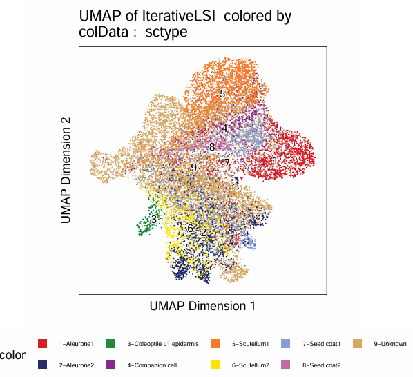 
  > 注释可信度`[rna_key]_confidence`的umap
  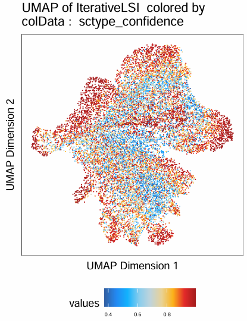 
  > 对ArchR分群的`[atac_key] Clusters`按最多细胞类型做注释获得`[rna_key]_max`的新键
  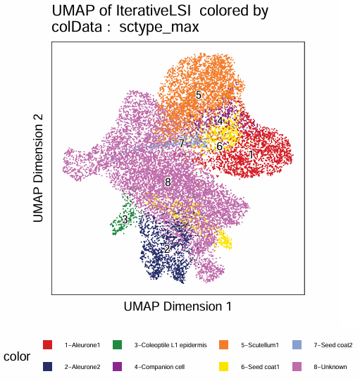 
  > 对应Clusters细胞含量热图，对应`[rna_key]_max`的获得
  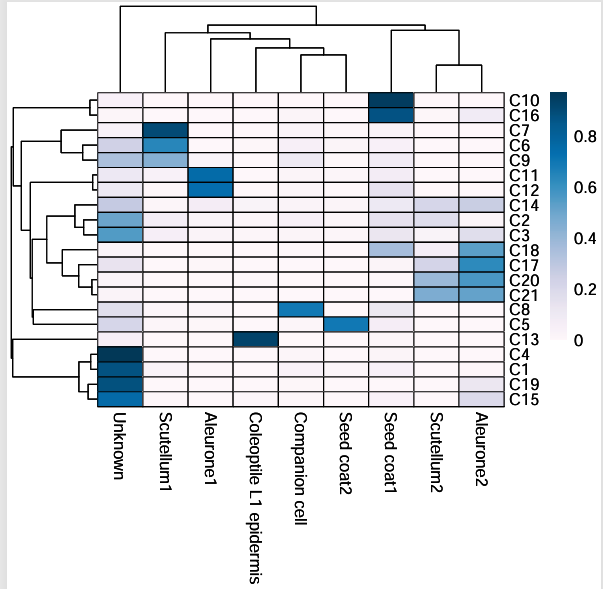
- {prefix}_Plot-UMAP-GLUE_split.pdf
  > 按`[rna_key]`和`[atac_key]`拆分的umap，直观看population
  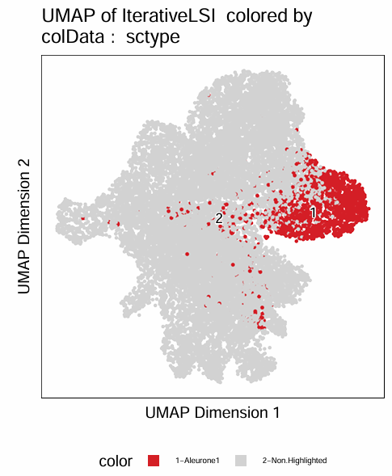 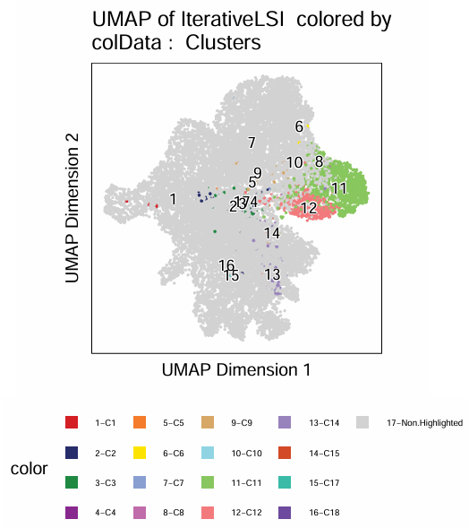
- {prefix}_RNA.correlation.pdf
  > RNA的细胞类型间的correlation, based on HVG expression
  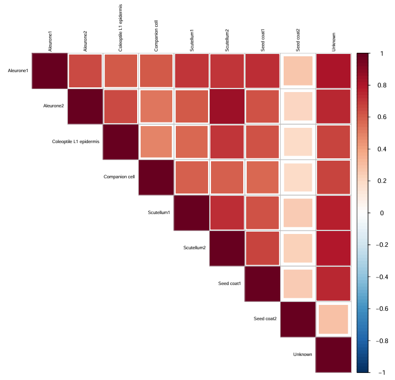
- {prefix}_RNA_ATAC.correlation.pdf
  > RNA和ATAC的correlation, based on HVG expression
  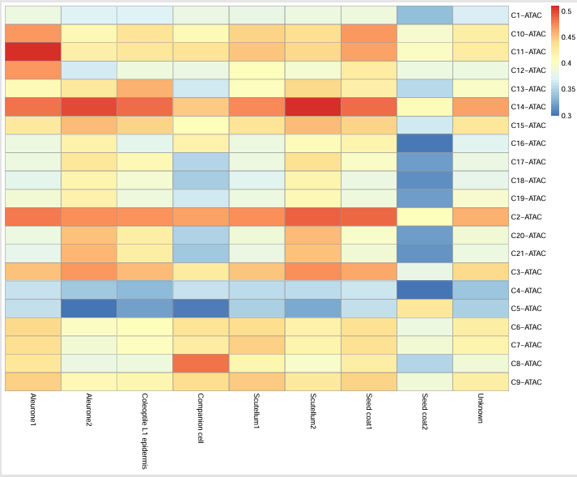
- {prefix}_annotation.pdf
  > 整合三个证据的dotplot，包括cell-specific genes，cca and glue
  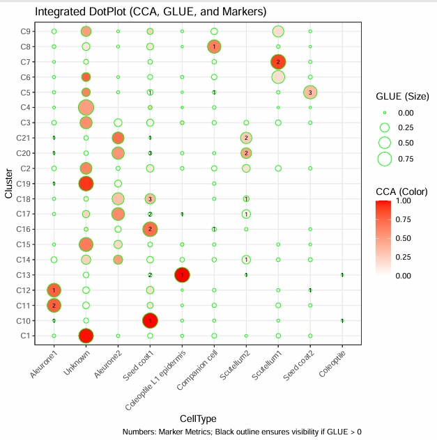

</summary>

## `9` plot_peak_gene
> 可视化感兴趣基因集合附近的染色质开放情况。
- [plot_peak_gene.R](../SCRIPTs/plot_peak_gene.R)
- input:
- output:

## `10` footprinting

No-Normalization
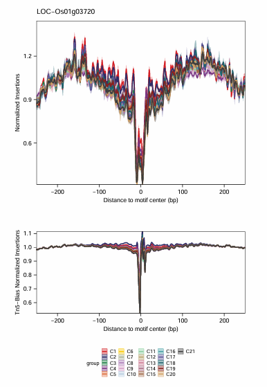
Divide
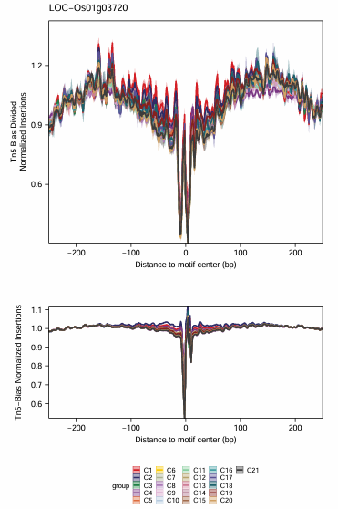
Subtrac
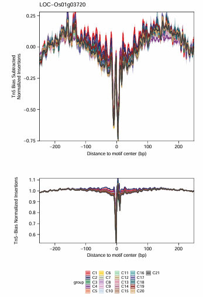


## `11` trajectory

## `12` custom-analysis