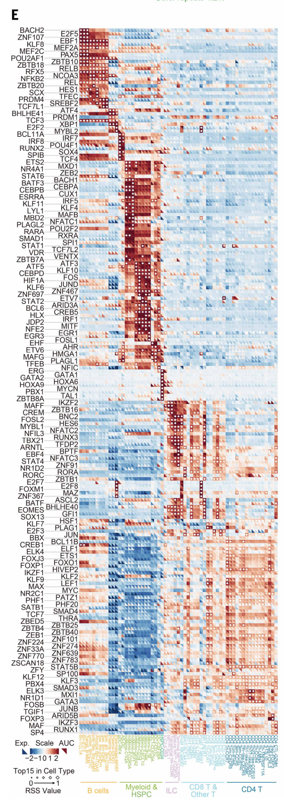
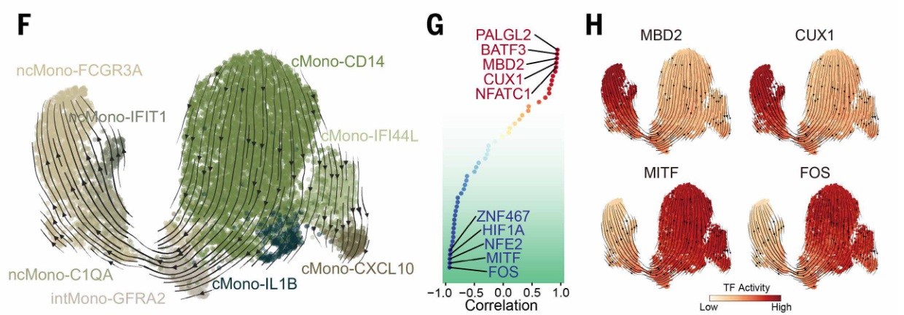
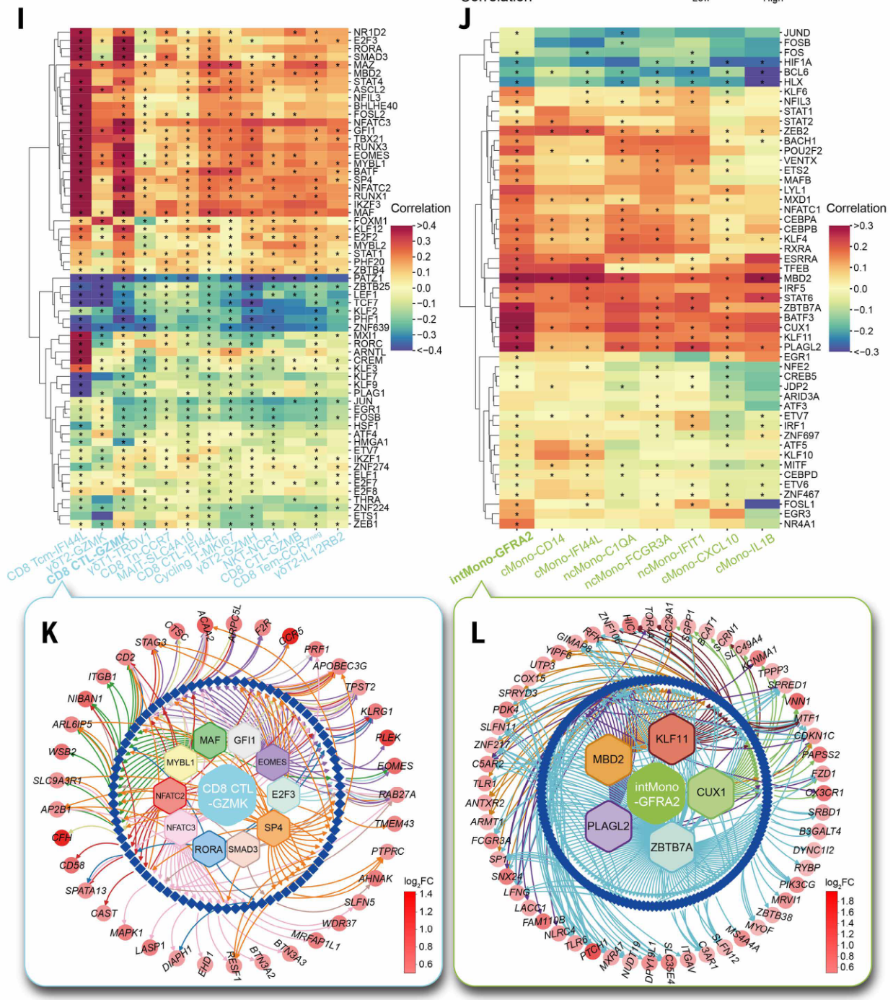
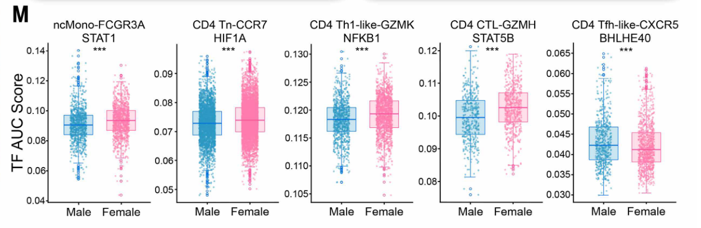

# scenicplus
> 使用非配对RNA和ATAC数据构建调控网络。

## references
- https://github.com/tanlabcode/SC_TALL/tree/main/SCENIC+
- https://github.com/CIMA-Project/CIMA/tree/main/GRN
- https://github.com/aertslab/create_cisTarget_databases/tree/master


## run scenicplus
- fa
- gtf
- motf.meme
- tf_motif.txt

**config.yaml**
- input_data
  - cisTopic_obj_fname 以.pkl结尾ATAC_cistopic_obj_with_model.pkl
  - GEX_anndata_fname .h5ad文件
  - region_set_folder region_sets文件夹
  - ctx_db_fname motifs.rankings.feather文件，motif获得 √
  - dem_db_fname _motifs.scores.feather得分文件，q&a即rank和score的区别是什么 √
  - path_to_motif_annotations .tbl文件即tf和motif的对应关系 √


### `1` 从ArchR获得cell乘peak的.rds
```R
archr_project=
prefix=
library(ArchR)
projHeme2 <- loadArchRProject(archr_project)
peakMatrix <- getMatrixFromProject(projHeme2, useMatrix = "PeakMatrix")
seu_atac <- SummarizedExperiment::assay(peakMatrix)
rownames(seu_atac) <- paste(peakMatrix@rowRanges@seqnames, peakMatrix@rowRanges@ranges, sep = "-")
seu_atac <- CreateSeuratObject(counts = seu_atac, assay = "peaks", meta.data = as.data.frame(colData(peakMatrix)))
saveRDS(seu_atac, file = paste0(prefix, "_peaks.rds"))
```

### `2` 从atac的提取region并为后续构建cistopic对象做准备
Prepare_Data_BMP_TSpec.R：使用 ATAC-seq 峰值生成 cistarget 数据库所需的bed文件。
- Input
  - rna_rds
  - atac_rds
- Output
  - RNA.loom
  - subset_RNA.loom
  - ATAC_Peaks_Sparse.mtx
  - ATAC_Cell_Names.txt
  - ATAC_Region_Names.txt
  - ATAC_Region_Names.bed
  - ATAC_Metadata.txt

```shell


```

```shell
## 
## image: scenicplus-docker
REGION_BED="/data/work/scenic/atac_region_names.bed" # 获得region_bed from scATAC
GENOME_FASTA="/data/work/scenic/input/osa1_r7.asm.chrs.fa"
CHROMSIZES="/data/work/scenic/chrom.sizes"
DATABASE_PREFIX="Os"
SCRIPT_DIR="/software/create_cisTarget_databases"

bash /data/work/scenic/create_fasta_with_padded_bg_from_bed.sh \
        ${GENOME_FASTA} \
        ${CHROMSIZES} \
        ${REGION_BED} \
        ${DATABASE_PREFIX}_1000bp_bg_padding.fa \
        1000 \
        yes
```

```shell
## image: GRN-allSCENIC--01
## Create_Cistarget_Motif.sh
CBDIR="/data/work/scenic/input/Os_motif_dir" # motif_dir
FASTA_FILE="/data/work/scenic/Os_1000bp_bg_padding.fa" # focused region e.g. promoters/peaks
MOTIF_LIST="/data/work/scenic/input/Os_motifs_id.txt" # motif_id
SCRIPT_DIR="/data/work/scenic/input" # directory of scripts of create_cistarget_motif_databases
DATABASE_PREFIX="Os"

# --bgpadding BG_PADDING 这个参数的意义是：告诉工具，在生成FASTA文件时，每条序列的两端额外添加了多少个碱基（bp）作为“填充”
python "${SCRIPT_DIR}/create_cistarget_motif_databases_yd.py" \
    -f ${FASTA_FILE} \
    -M ${CBDIR} \
    -m ${MOTIF_LIST} \
    -o ${DATABASE_PREFIX} \
    --bgpadding 1000 \
    -t 40
```


```shell
## image: scenicplus-docker


```


## DEMOs

<details> <summary> demo1: </summary>

### demo1 https://github.com/tanlabcode/SC_TALL/tree/main/SCENIC+
**config.yaml**
- input_data
  - cisTopic_obj_fname 以.pkl结尾ATAC_cistopic_obj_with_model.pkl
  - GEX_anndata_fname .h5ad文件
  - region_set_folder region_sets文件夹
  - ctx_db_fname motifs.rankings.feather文件，motif获得 √
  - dem_db_fname _motifs.scores.feather得分文件，q&a即rank和score的区别是什么 √
  - path_to_motif_annotations .tbl文件即tf和motif的对应关系 √
- output

**Prepare_Data_BMP_TSpec.R**：使用 ATAC-seq 峰值生成 cistarget 数据库所需的bed文件。
- Input
  - rna_rds
  - atac_rds
- Output
  - RNA.loom
  - subset_RNA.loom
  - ATAC_Peaks_Sparse.mtx
  - ATAC_Cell_Names.txt
  - ATAC_Region_Names.txt
  - ATAC_Region_Names.bed
  - ATAC_Metadata.txt

**Prepare_FASTA.sh**：准备 FASTA 文件并基于 ATAC 峰创建峰值文件，准备包含感兴趣区域的 FASTA 文件。
- Input
  - ATAC_Region_Names.bed
  - ?hg38.fa
  - ?hg38.chrom.sizes
- Output
  - hg38_T_ALL_1kb_bg_padding.fa

**Create_Cistarget_Motif.sh**：以正确的格式准备数据库结合ATAC-seq数据库结果，构建本地数据库以获得最佳分析结果。
- Input
  - hg38_T_ALL_1kb_bg_padding.fa
  - motifs.txt
  - CBDIR="/mnt/isilon/tan_lab/sussmanj/Single_Cell_Tools/ScenicPlus/Motif_Collection/v10nr_clust_public/singletons"
- Output


**T_ALL_Setup_SCENICPlus_BMP_TSpec.ipynb**：设置 SCENIC+ 的 Jupyter Notebook 环境，包括 pycistopic 预处理配置 Jupyter Notebook 环境并安装 SCENIC+ 所需的依赖项。使用 pycistopic 对输入数据进行分析和预处理，例如构建染色质可及性特征矩阵。

基于 config.yaml 参数运行 SCENIC+ 管道创建 config.yaml 配置文件，设定物种、参考基因组和分析参数。启动 SCENIC+ 管道进行转录调控网络推断和调控因子识别。
**T_ALL_Review_SCENICPlus_BMP_TSpec.ipynb**：在Jupyter Notebook 中可视化调控网络，分析关键调控因子和目标基因。后处理和结果检查（Jupyter Notebook）整理 SCENIC+ 输出结果，例如调控网络和调控因子目标基因集。


BigWig 是一种用于存储和展示基因组数据（如测序覆盖度、信号强度）的二进制索引文件格式，由 UCSC Genome Browser 开发。

</details>

<details> <summary> demo2: CIMA/GRN </summary>

### demo2: [CIMA/GRN](https://github.com/CIMA-Project/CIMA/tree/main/GRN)
- 2026|science Chinese Immune Multi-Omics Atlas *Fig. 3. Construction of immune cell–specific GRNs.*
  - region和gene的分布/类别/关系。**a**.基因组元件的分布；**b**.ENCODE功能区域与cCRE的关系，将cCRE分ovrlap交集部分和非交集部分，cCRE分类按单独的CRE可以作为多少个细胞类型特异的CRE即cCRE来看，overlap部分多细胞类型的cCRE多，而非overlap部分少细胞类型的cCRE多；**c**.tf的数量和被调控的region数量呈正比；密度图，TF-link-onegene，解读：大多数基因由少量TF调控（中位数约5个），少数基因受大量TF调控（可达30+个）生物学意义：基因调控遵循"少数核心TF主导"的原则，符合scale-free网络特征；解读：大多数调控区域仅结合1-3个TF，少数热点区域可结合10+个TF 生物学意义：调控区域通常是TF共结合（co-binding）的平台，但共结合的TF数量普遍较少；解读：基因通常受多个调控区域共同调控（中位数约12个），分布比前两者更分散 生物学意义：体现了增强子冗余和组合调控机制，一个基因往往有多个增强子/沉默子协同调控。
  
    > 展示了基因组元件的组成，从之前的简单测序到后测序时代的功能解释，这些区域起到什么样的作用是我们最会关心的。其中最为关心的是转录调控因子主导的调控网络，调控网络是复杂的，基于计算我们常常关注有实验支持的，而后面如何de novo发现in silico的调控关系值得我们去思考。ENCODE是面向人解析序列区域功能的项目，在植物是否有类似振奋人心的项目？通过将新找到的region和之前注释的某些区域进行对比，一方面是验证说明其数据的可靠性，另一方面为后面的de novo发现提供了支撑。从分子生物学出发，一个转录事件的开始到结束由复杂的因子去调控驱动，那么其本身就是复杂的，可能存在多个因子同时存在才有作用的情况，也存在多个基因的冗余即发挥同样的功能，只需一个表达即可。生物的复杂性需要我们保留一些想象空间。而作者通过density的方式去展示tf-gene的关系，从某种方面来说可以说明这个基因是多因子调控还是单因子调控，这将影响后续的实验检测，这是一个很好的例子，从计算找到突破口，定量到定性。TF-region-target三者的关系是比较复杂的，简单的线性来看便于理解，但绝不应该限于此。
  - 细胞类型特异的调控网络cGRN。 heatmap of TF expression levels and area under the curve (AUC) scores and dot plots showing the regulon-specific score (RSS) of the top 15 TFs in each cell type. 复杂热图：左下半格表示表达强弱，右上半格表示AUC高低，菱形表示细胞特异top15，菱形大小表示RSS的值。
  
  - 时序发育的调控网络与关键的转录因子。f. [scTour](https://pubmed.ncbi.nlm.nih.gov/37353848/)轨迹；g. 转录因子活性与时序的相关性，找到时序相关的转录因子；h. 可视化其最显著和最关注基因的活性；
  
  - 转录因子与年龄相关基因的相关性。I和J，横轴为年龄相关基因，纵轴为转录因子活性，找到调控年龄的转录因子，*按时其显著性；k和l，可视化感兴趣的年龄index基因与转录调控网络的关系，年龄index基因--转录因子--motif/region--下游基因
  
  - 对照的调控差异
  


</details>
