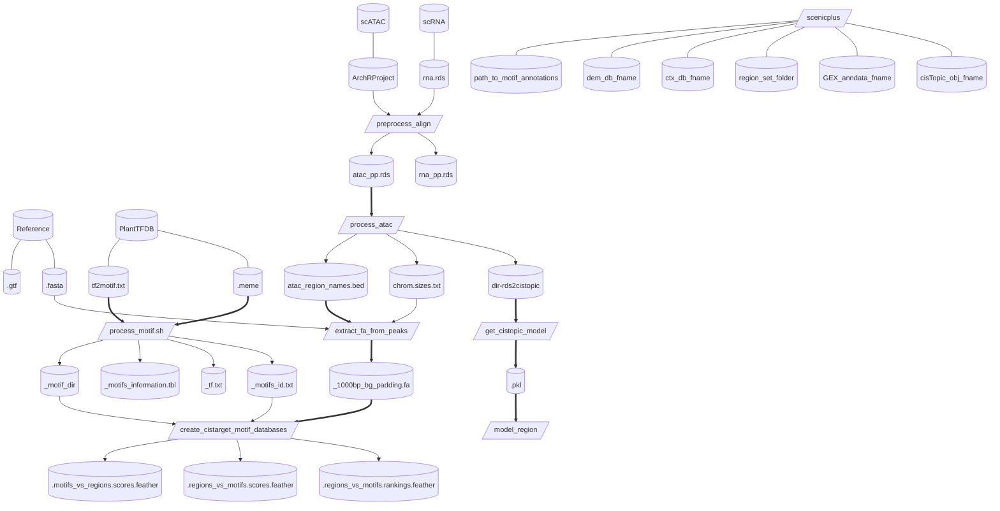
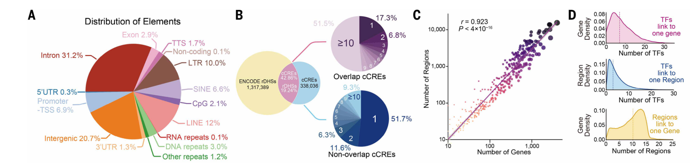

# scenicplus
> 使用非配对RNA和ATAC数据构建调控网络。Single-Cell Enhancer-driven gene regulatory Network Inference and Clustering.

## references
- https://github.com/tanlabcode/SC_TALL/tree/main/SCENIC+
- https://github.com/CIMA-Project/CIMA/tree/main/GRN
- https://github.com/aertslab/create_cisTarget_databases/tree/master
- https://deepwiki.com/aertslab/scenicplus


> [!NOTE]
> - rna和atac的细胞类型的键要一致且细胞类型也一致
> - rna的h5ad必须包含.raw
> - gene.annotation必须包含`ValueError: gene_annotation should have the following columns: Chromosome, Start, End, Strand, Gene, Transcription_Start_Site`
> - `chromsizes should have the following columns: Chromosome, Start, End`
> - 非常消耗cpu，memory不怎么消耗

- [extract_peakmatrix.R](../Scripts/extract_peakmatrix.R) 输入：archrproject；输出：peaks.rds
- [process_atac.R](../Scripts/process_atac.R) GRN-allSCENIC--01 输入：peak.rds，fa，gtf；输出：cistopic对象文件夹，region.bed，chrome.size和gene_annotation
- [get_cistopic_model.R](../Scripts/get_cistopic_model.py) 输入：cistopic对象文件夹；输出：cistopic_model.pkl，region的文件夹
- [rds2h5ad](../Scripts/rds2h5ad.R) 转rna.rds为rna.h5ad
- [process_motif]
- [create_cistarget_db]
- [scenicplus]


我应该先看人的数据结构是怎么样的，以及从planttfdb拿到的数据结构是怎样的
- TF-motif的来源，一是直接实验得到的，二是同源得到的，三是motif相似性得到的
- scenic读取tbl文件必须要的列`'#motif_id', 'gene_name', 'motif_similarity_qvalue', 'orthologous_identity', 'description'`，查看于utils.py函数`load_motif_annotations()`
- 其中tbl文件中description内容来确定类别，为'gene is directly annotated'则是`Direct_annot`；包含'similar'则为`Motif_similarity_annot`；包含'orthologous'则为`Orthology_annot`，'similar'和'orthologous'都包含则为'Motif_similarity_and_Orthology_annot'，我们水稻只关注`Direct_annot`和`Orthology_annot`

```R
> colnames(df1)                
[1] "Gene_id"       "Family"        "Matrix_id"     "Species"      
[5] "Method"        "Datasource"    "Datasource_ID"
> colnames(df)                 
 [1] "motif_id"                  "motif_name"               
 [3] "motif_description"         "source_name"              
 [5] "source_version"            "gene_name"                
 [7] "motif_similarity_qvalue"   "similar_motif_id"         
 [9] "similar_motif_description" "orthologous_identity"     
[11] "orthologous_gene_name"     "orthologous_species"      
[13] "description"              
> 
# ----------- 构建适配于scenicplus的.tbl文件，下面是对应关系和orthology的处理 --------------
#motif_id=Matrix_id
motif_name=Matrix_id
motif_description=Family
source_name=Datasource
source_version="5.0"
gene_name=Gene_id
motif_similarity_qvalue=0
similar_motif_id="None"
similar_motif_description="None"
description=Datasource_ID
# # 对该行的Datasource_ID列的值先(分割，然后再按空格对第一部分按空格分割。假如值是transfer from AT1G68320(Arabidopsis thaliana)，则最后list=c("transfer", "from", "AT1G68320", "(Arabidopsis thaliana)")。判断list[1]是"trnasfer"，是则orthologous_identity=0.1，orthologous_gene_name=list[3],orthologous_species=gsub("( && )", "", list[4])[[1]] 即Arabidopsis thaliana。list[1]不是"trnasfer"，则orthologous_identity=0，orthologous_gene_name=Gene_id,orthologous_species="None"
orthologous_identity= 
orthologous_gene_name=
orthologous_species= 
```

```R
> df <- read.table('./DATA/motifs-v10-nr.hgnc-m0.00001-o0.0.tbl', sep = '\t', $
> head(df)                                                       
           motif_id motif_name motif_description source_name source_version
1 metacluster_196.3    EcR_usp           EcR/usp     bergman            1.1
2 metacluster_196.3    EcR_usp           EcR/usp     bergman            1.1
3 metacluster_196.3    EcR_usp           EcR/usp     bergman            1.1
4 metacluster_196.3    EcR_usp           EcR/usp     bergman            1.1
5 metacluster_196.3    EcR_usp           EcR/usp     bergman            1.1
6 metacluster_196.3    EcR_usp           EcR/usp     bergman            1.1
  gene_name motif_similarity_qvalue similar_motif_id similar_motif_description
1     HNF4A                       0             None                      None
2     HNF4G                       0             None                      None
3     NR1D1                       0             None                      None
4     NR1D2                       0             None                      None
5     NR1H2                       0             None                      None
6     NR1H3                       0             None                      None
  orthologous_identity orthologous_gene_name orthologous_species
1             0.270042           FBgn0003964     D. melanogaster
2             0.276923           FBgn0003964     D. melanogaster
3             0.157980           FBgn0000546     D. melanogaster
4             0.170984           FBgn0000546     D. melanogaster
5             0.317391           FBgn0000546     D. melanogaster
6             0.326622           FBgn0000546     D. melanogaster
                                                                                                   description
1 gene is orthologous to FBgn0003964 in D. melanogaster (identity = 27%) which is directly annotated for motif
2 gene is orthologous to FBgn0003964 in D. melanogaster (identity = 27%) which is directly annotated for motif
3 gene is orthologous to FBgn0000546 in D. melanogaster (identity = 15%) which is directly annotated for motif
4 gene is orthologous to FBgn0000546 in D. melanogaster (identity = 17%) which is directly annotated for motif
5 gene is orthologous to FBgn0000546 in D. melanogaster (identity = 31%) which is directly annotated for motif
6 gene is orthologous to FBgn0000546 in D. melanogaster (identity = 32%) which is directly annotated for motif
> df1 <- read.table('./DATA/Osj_TF_binding_motifs_information.txt', sep = '\t'$
> head(df1)
         Gene_id      Family Matrix_id                      Species Method
1 LOC_Os01g03720         MYB   MP00216 Oryza sativa subsp. japonica    DAP
2 LOC_Os01g07120         ERF   MP00302 Oryza sativa subsp. japonica    DAP
3 LOC_Os01g07480         LBD   MP00581 Oryza sativa subsp. japonica    DAP
4 LOC_Os01g08160     G2-like   MP00261 Oryza sativa subsp. japonica    DAP
5 LOC_Os01g09550         NAC   MP00460 Oryza sativa subsp. japonica    DAP
6 LOC_Os01g09640 MYB_related   MP00565 Oryza sativa subsp. japonica    DAP
  Datasource                                 Datasource_ID
1  PlantTFDB transfer from AT1G68320(Arabidopsis thaliana)
2  PlantTFDB transfer from AT2G40340(Arabidopsis thaliana)
3  PlantTFDB transfer from AT5G63090(Arabidopsis thaliana)
4  PlantTFDB transfer from AT2G03500(Arabidopsis thaliana)
5  PlantTFDB transfer from AT4G29230(Arabidopsis thaliana)
6  PlantTFDB transfer from AT5G56840(Arabidopsis thaliana)
```




定位scenicplus的snakefile
```shell
python -c "import scenicplus; print(scenicplus.__file__)"
# /usr/local/lib/python3.11/site-packages/scenicplus/snakemake
```

```shell
# 如果已有 GTF 文件和基因组 FASTA
# 自己构建

species="hsapiens"
biomart_host="http://www.ensembl.org"
scenicplus prepare_data download_genome_annotations \
    --species $species \
    --biomart_host $biomart_host \
    --genome_annotation_out_fname "$species".genome_annotation.tsv \
    --chromsizes_out_fname "$species".chromsizes.tsv

# for plant
scenicplus prepare_data download_genome_annotations \
    --species osativa \
    --biomart_host "https://plants.ensembl.org" \
    --genome_annotation_out_fname osativa.genome_annotation.tsv \
    --chromsizes_out_fname osativa.chromsizes.tsv
```

## run scenicplus
- fa
- gtf
- motf.meme
- tf_motif.txt
- rna: .h5ad *(from scanpy/seeurat, when from seurat: rds --> loom --> h5ad)* [rds2h5ad.R]()
- atac: .pkl *(from ArchR: rds --> cistopic --> [with models])*

**config.yaml**
- input_data
  - cisTopic_obj_fname 以.pkl结尾ATAC_cistopic_obj_with_model.pkl
  - GEX_anndata_fname .h5ad文件
  - region_set_folder region_sets文件夹
  - ctx_db_fname motifs.rankings.feather文件，motif获得 √
  - dem_db_fname _motifs.scores.feather得分文件，q&a即rank和score的区别是什么 √
  - path_to_motif_annotations .tbl文件即tf和motif的对应关系 √


### `1` 从ArchR获得cell乘peak的.rds
```R
archr_project=
prefix=
library(ArchR)
projHeme2 <- loadArchRProject(archr_project)
peakMatrix <- getMatrixFromProject(projHeme2, useMatrix = "PeakMatrix")
seu_atac <- SummarizedExperiment::assay(peakMatrix)
rownames(seu_atac) <- paste(peakMatrix@rowRanges@seqnames, peakMatrix@rowRanges@ranges, sep = "-")
seu_atac <- CreateSeuratObject(counts = seu_atac, assay = "peaks", meta.data = as.data.frame(colData(peakMatrix)))
saveRDS(seu_atac, file = paste0(prefix, "_peaks.rds"))
```

### `2` 从atac的提取region并为后续构建cistopic对象做准备
Prepare_Data_BMP_TSpec.R：使用 ATAC-seq 峰值生成 cistarget 数据库所需的bed文件。
- Input
  - rna_rds
  - atac_rds
- Output
  - RNA.loom
  - subset_RNA.loom
  - ATAC_Peaks_Sparse.mtx
  - ATAC_Cell_Names.txt
  - ATAC_Region_Names.txt
  - ATAC_Region_Names.bed
  - ATAC_Metadata.txt

## extract_fa_from_peaks
```shell
## 
## image: scenicplus-docker
REGION_BED="/data/work/scenic/atac_region_names.bed" # 获得region_bed from scATAC
GENOME_FASTA="/data/work/scenic/input/osa1_r7.asm.chrs.fa"
CHROMSIZES="/data/work/scenic/chrom.sizes"
DATABASE_PREFIX="Os"
SCRIPT_DIR="/software/create_cisTarget_databases"

bash /data/work/scenic/create_fasta_with_padded_bg_from_bed.sh \
        ${GENOME_FASTA} \
        ${CHROMSIZES} \
        ${REGION_BED} \
        ${DATABASE_PREFIX}_1000bp_bg_padding.fa \
        1000 \
        yes
```

## create_cistarget_motif_databases
```shell
## image: GRN-allSCENIC--01
## Create_Cistarget_Motif.sh
CBDIR="/data/work/scenic/input/Os_motif_dir" # motif_dir
FASTA_FILE="/data/work/scenic/Os_1000bp_bg_padding.fa" # focused region e.g. promoters/peaks
MOTIF_LIST="/data/work/scenic/input/Os_motifs_id.txt" # motif_id
SCRIPT_DIR="/data/work/scenic/input" # directory of scripts of create_cistarget_motif_databases
DATABASE_PREFIX="Os"

# --bgpadding BG_PADDING 这个参数的意义是：告诉工具，在生成FASTA文件时，每条序列的两端额外添加了多少个碱基（bp）作为“填充”
python "${SCRIPT_DIR}/create_cistarget_motif_databases_yd.py" \
    -f ${FASTA_FILE} \
    -M ${CBDIR} \
    -m ${MOTIF_LIST} \
    -o ${DATABASE_PREFIX} \
    --bgpadding 1000 \
    -t 40
```
**output**
- {species}.regions_vs_motifs.rankings.feather
- {species}.regions_vs_motifs.scores.feather
- {species}.motifs_vs_regions.scores.feather


## get_cistopic
LDA (Latent Dirichlet Allocation，潜在狄利克雷分配) 是 pycisTopic 用来识别“主题”的核心数学模型。它最初是一种用于文本处理的算法（用于找出文章中的“主题”），但在单细胞分析中被赋予了表观基因组学的含义。
LDA与LSI算法有异曲同工的感觉，我觉得可以理解为pca。
什么是topic，topic是不是基因集/区域集
50 个 Topic 代表了 50 个独特的调控“标签”。通过观察哪些细胞拥有哪些 Topic 的权重最高，研究人员就可以判断这些细胞属于哪种状态。
```shell
## image: scenicplus-docker
atac4cistopic_dir="/data/work/scenic/atac4cistopic"
mallet_path = "/data/work/scenic/Mallet-202108/bin/mallet"
n_cpu=32
mallet_mem='256G'
atac_key='sctype'

ATAC_cistopic_obj.pkl
ATAC_Models_500_iter_LDA.pkl
ATAC_cistopic_obj_with_model.pkl

```
output
输出model.pkl，已经三个region_set的文件目录，这些region是重点关注的区域，细胞类型特异的region，全部的region，已经特异的3k的region。

## Q&A
- topic的意义是什么
- 三个feather文件各自的意义

### 查看cistopic对象

要查看 `cistopic_obj` 的 metadata 信息（基因名和细胞名），可以使用以下方法：

#### 1. 查看细胞名（Cell names）

```python
# 方法1：直接获取细胞名
cistopic_obj.cell_names

# 方法2：查看细胞元数据
cistopic_obj.cell_data

# 方法3：如果是从 anndata 创建的对象
cistopic_obj.adata.obs_names
```

#### 2. 查看基因名（Gene names）

```python
# 方法1：直接获取基因名
cistopic_obj.gene_names

# 方法2：查看基因元数据
cistopic_obj.gene_data

# 方法3：如果是从 anndata 创建的对象
cistopic_obj.adata.var_names
```

#### 3. 查看完整的 metadata

```python
# 查看对象的所有可用属性
print(dir(cistopic_obj))

# 查看对象的结构（如果支持）
cistopic_obj

# 查看 shape（细胞数 × 基因数）
print(f"细胞数: {cistopic_obj.n_cells}")
print(f"基因数: {cistopic_obj.n_genes}")

# 查看前几个细胞名和基因名
print("前5个细胞名:", cistopic_obj.cell_names[:5])
print("前5个基因名:", cistopic_obj.gene_names[:5])

# 查看细胞和基因的完整 metadata
cistopic_obj.cell_data.head()
cistopic_obj.gene_data.head()
```

#### 4. 转换为 DataFrame 查看

```python
# 将细胞名转换为 DataFrame
import pandas as pd
cell_df = pd.DataFrame(cistopic_obj.cell_names, columns=["cell_name"])
gene_df = pd.DataFrame(cistopic_obj.gene_names, columns=["gene_name"])

print(cell_df.head())
print(gene_df.head())
```

#### 5. 如果对象包含 anndata 对象

```python
# 查看 anndata 对象信息
cistopic_obj.adata
cistopic_obj.adata.obs  # 细胞metadata
cistopic_obj.adata.var  # 基因metadata
```

先试试 `cistopic_obj.cell_names` 和 `cistopic_obj.gene_names`，这应该是最直接的查看方式。

## DEMOs

<details> <summary> demo1: </summary>

### demo1 https://github.com/tanlabcode/SC_TALL/tree/main/SCENIC+
**config.yaml**
- input_data
  - cisTopic_obj_fname 以.pkl结尾ATAC_cistopic_obj_with_model.pkl
  - GEX_anndata_fname .h5ad文件
  - region_set_folder region_sets文件夹
  - ctx_db_fname motifs.rankings.feather文件，motif获得 √
  - dem_db_fname _motifs.scores.feather得分文件，q&a即rank和score的区别是什么 √
  - path_to_motif_annotations .tbl文件即tf和motif的对应关系 √
- output

**Prepare_Data_BMP_TSpec.R**：使用 ATAC-seq 峰值生成 cistarget 数据库所需的bed文件。
- Input
  - rna_rds
  - atac_rds
- Output
  - RNA.loom
  - subset_RNA.loom
  - ATAC_Peaks_Sparse.mtx
  - ATAC_Cell_Names.txt
  - ATAC_Region_Names.txt
  - ATAC_Region_Names.bed
  - ATAC_Metadata.txt

**Prepare_FASTA.sh**：准备 FASTA 文件并基于 ATAC 峰创建峰值文件，准备包含感兴趣区域的 FASTA 文件。
- Input
  - ATAC_Region_Names.bed
  - ?hg38.fa
  - ?hg38.chrom.sizes
- Output
  - hg38_T_ALL_1kb_bg_padding.fa

**Create_Cistarget_Motif.sh**：以正确的格式准备数据库结合ATAC-seq数据库结果，构建本地数据库以获得最佳分析结果。
- Input
  - hg38_T_ALL_1kb_bg_padding.fa
  - motifs.txt
  - CBDIR="/mnt/isilon/tan_lab/sussmanj/Single_Cell_Tools/ScenicPlus/Motif_Collection/v10nr_clust_public/singletons"
- Output


**T_ALL_Setup_SCENICPlus_BMP_TSpec.ipynb**：设置 SCENIC+ 的 Jupyter Notebook 环境，包括 pycistopic 预处理配置 Jupyter Notebook 环境并安装 SCENIC+ 所需的依赖项。使用 pycistopic 对输入数据进行分析和预处理，例如构建染色质可及性特征矩阵。

基于 config.yaml 参数运行 SCENIC+ 管道创建 config.yaml 配置文件，设定物种、参考基因组和分析参数。启动 SCENIC+ 管道进行转录调控网络推断和调控因子识别。
**T_ALL_Review_SCENICPlus_BMP_TSpec.ipynb**：在Jupyter Notebook 中可视化调控网络，分析关键调控因子和目标基因。后处理和结果检查（Jupyter Notebook）整理 SCENIC+ 输出结果，例如调控网络和调控因子目标基因集。


BigWig 是一种用于存储和展示基因组数据（如测序覆盖度、信号强度）的二进制索引文件格式，由 UCSC Genome Browser 开发。

</details>

<details> <summary> demo2: CIMA/GRN </summary>

### demo2: [CIMA/GRN](https://github.com/CIMA-Project/CIMA/tree/main/GRN)
- 2026|science Chinese Immune Multi-Omics Atlas *Fig. 3. Construction of immune cell–specific GRNs.*
  - region和gene的分布/类别/关系。**a**.基因组元件的分布；**b**.ENCODE功能区域与cCRE的关系，将cCRE分ovrlap交集部分和非交集部分，cCRE分类按单独的CRE可以作为多少个细胞类型特异的CRE即cCRE来看，overlap部分多细胞类型的cCRE多，而非overlap部分少细胞类型的cCRE多；**c**.tf的数量和被调控的region数量呈正比；密度图，TF-link-onegene，解读：大多数基因由少量TF调控（中位数约5个），少数基因受大量TF调控（可达30+个）生物学意义：基因调控遵循"少数核心TF主导"的原则，符合scale-free网络特征；解读：大多数调控区域仅结合1-3个TF，少数热点区域可结合10+个TF 生物学意义：调控区域通常是TF共结合（co-binding）的平台，但共结合的TF数量普遍较少；解读：基因通常受多个调控区域共同调控（中位数约12个），分布比前两者更分散 生物学意义：体现了增强子冗余和组合调控机制，一个基因往往有多个增强子/沉默子协同调控。
  
    > 展示了基因组元件的组成，从之前的简单测序到后测序时代的功能解释，这些区域起到什么样的作用是我们最会关心的。其中最为关心的是转录调控因子主导的调控网络，调控网络是复杂的，基于计算我们常常关注有实验支持的，而后面如何de novo发现in silico的调控关系值得我们去思考。ENCODE是面向人解析序列区域功能的项目，在植物是否有类似振奋人心的项目？通过将新找到的region和之前注释的某些区域进行对比，一方面是验证说明其数据的可靠性，另一方面为后面的de novo发现提供了支撑。从分子生物学出发，一个转录事件的开始到结束由复杂的因子去调控驱动，那么其本身就是复杂的，可能存在多个因子同时存在才有作用的情况，也存在多个基因的冗余即发挥同样的功能，只需一个表达即可。生物的复杂性需要我们保留一些想象空间。而作者通过density的方式去展示tf-gene的关系，从某种方面来说可以说明这个基因是多因子调控还是单因子调控，这将影响后续的实验检测，这是一个很好的例子，从计算找到突破口，定量到定性。TF-region-target三者的关系是比较复杂的，简单的线性来看便于理解，但绝不应该限于此。
  - 细胞类型特异的调控网络cGRN。 heatmap of TF expression levels and area under the curve (AUC) scores and dot plots showing the regulon-specific score (RSS) of the top 15 TFs in each cell type. 复杂热图：左下半格表示表达强弱，右上半格表示AUC高低，菱形表示细胞特异top15，菱形大小表示RSS的值。
  
  - 时序发育的调控网络与关键的转录因子。f. [scTour](https://pubmed.ncbi.nlm.nih.gov/37353848/)轨迹；g. 转录因子活性与时序的相关性，找到时序相关的转录因子；h. 可视化其最显著和最关注基因的活性；
  
  - 转录因子与年龄相关基因的相关性。I和J，横轴为年龄相关基因，纵轴为转录因子活性，找到调控年龄的转录因子，*按时其显著性；k和l，可视化感兴趣的年龄index基因与转录调控网络的关系，年龄index基因--转录因子--motif/region--下游基因
  
  - 对照的调控差异
  


</details>
