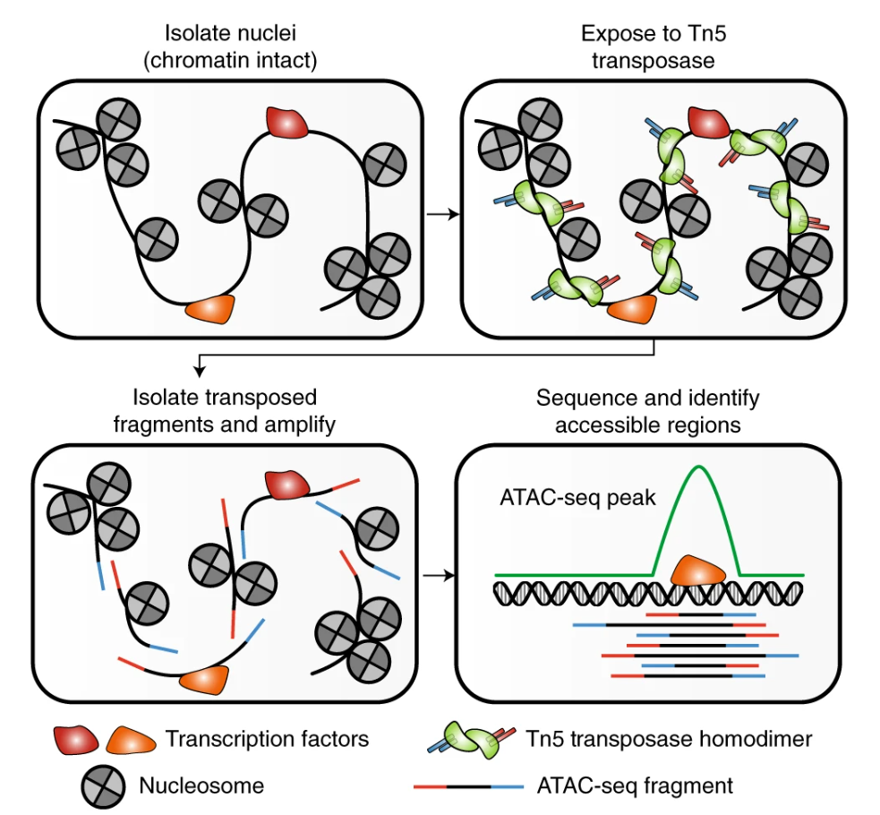
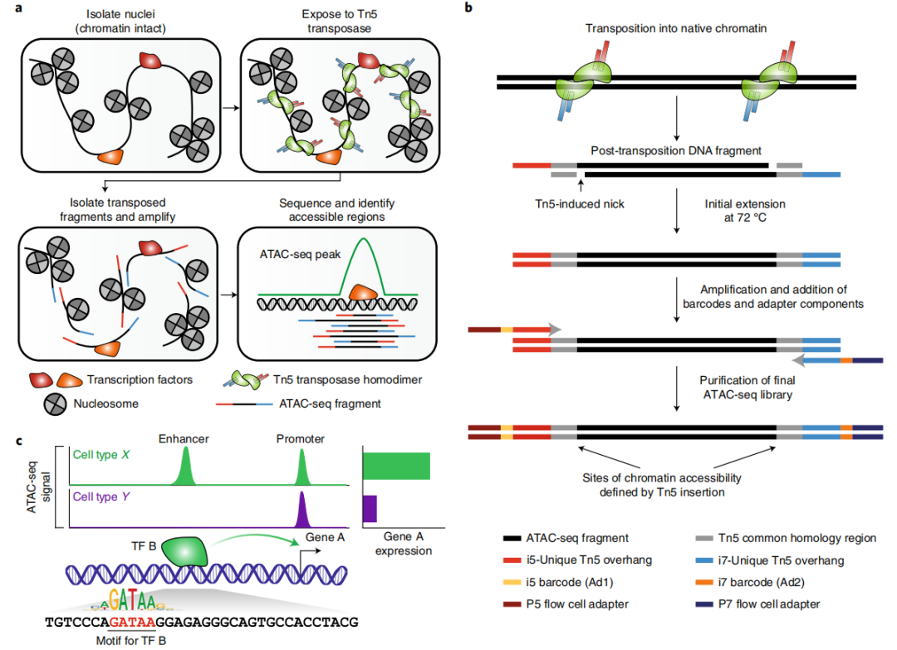

## ATAC实验技术



- 分离核：首先分离细胞核，保持染色质结构的完整。
- 转座酶处理：使用Tn5转座酶处理，它会结合并切割开放的染色质区域。
- 扩增与测序：分离出被Tn5切割的片段，进行PCR扩增和高通量测序。
- 区域鉴定：最后通过生物信息学分析，鉴定出序列中的可及性区域（即开放染色质区）及其ATAC-seq峰。

> Notes:
> - multiome: measured DNA accessibility and gene expression in the same cells
> - fragment可以认为是测序的读段，将read存在位置覆盖的区域提取为peak，peak即开放区域。在矩阵中peak为feature，等同于sxRNA里面的gene。不同于snRNA的样本数据，其特征为基因名，可以直接合并；而scATAC的特征是GRang，不同的样本单独提取的GRange不一致，所以在合并前一定要统一peak(具有一致的GRange)。
> - 如何基于华大scATAC-seq_V3构建出一个SeuratObject的呢？`CreateChromatinAssay`使用了fragment文件，拿到chrom_assay，然后基于`CreateSeuratObject`构建成功对象。相比于sxRNA多了metadata和fragment信息，fragment信息可以计算TSS富集、核小体分布等关键指标，灵活更改peak集合

```R
# fragments.tsv.gz 文件格式
# chr   start   end    cell_barcode   read_count
chr1    1000    1100    AAACCTGAG-1    2
chr1    1500    1600    AAACCTGAG-1    1
chr1    2000    2100    AAACCTGAG-1    3
```

---
## 学会看标准流程输出文件

文件结构
```shell

```

- 看报告`reports.html`
  - SUMMARY
    - Sample information：样本信息
      - Estimated number of cells：细胞数
      - Median fragments per cell：每个细胞片段数的中位数
      - Median fraction of fragments overlapping peaks：重叠峰的中位片段比例
      - Median fraction of fragments overlapping TSS：重叠于转录起始位点的中位片段比例
    - Beads to cells：barcode被确定为细胞的数量，x为细胞数，y为每个细胞的重叠峰片段数量。去除空细胞的barcode。
    - Summary
      - Sample ID
      - Species
      - Estimated number of cells
      - Mean raw read pairs per cell
      - Median fraction of fragments overlapping peaks
      - Mean fraction of fragments overlapping peaks
      - Median fraction of fragments overlapping TSS
      - Mean fraction of fragments overlapping TSS
      - Fraction of fragments in cells
      - Number of peaks
      - FRIP(Fraction of Reads/Fragments in/overlapping Peaks)，是ATAC-seq（以及ChIP-seq）数据分析中一个核心的质量控制指标，用于评估实验的“信噪比”或富集效率
    - Sequencing
      - Total number of reads pairs
      - Fraction of read pairs with a valid barcode
      - Reads mapped to genome：读段比对到参考基因组的占比
      - Mitochondria reads ratio
      - Fraction of nucleosome-free-regions：没有核小体的片段的占比
      - Fraction of fragments mono-nucleosome regions：单核小体的片段的占比
  - ANALYSIS
    - Cluster：左图为分群umap图，右图为每个细胞非重复fragment的密度umap图
    - Targeting：左图对TSS上下共2kp进行信号富集(relative enrichment)，越高越好？；右图对所有barcodes的片段重叠于TSS的占比进行了展示，被确定为cell的barcode分布集中，占比比较中性
    - Cell：
      - Percent of duplicates：来自细胞条形码的所有测序读取对的一部分，由于与文库中的另一个读取对对齐到相同的基因组位置，被视为PCR重复。
      - Jaccard threshold：将珠子条形码折叠为单元格条形码的jaccard指数阈值。
  > 水稻的ATAC的fraction为什么都很短，碎片化很明显
- 看metadata``
  - nCount_peaks 有多少个条目
  - nFeature_peaks 条目的种类
  - totalFrags 总的条目
  - fragments 条目
  - mt_region_fragments	
  - TSS_region_fragments
  - peaks_number 等于nFeature_peaks
  - peak_region_fragments	等于nCount_peaks
  - is_cell_barcode
  - Cellbarcode
  > 这么多frag，然后做了过滤，然后再富集到peak。理解fraction/fragment/peak
- 看fragment``
- 看10X_folder
  > scATAC的raw和filter的矩阵也可以联动做decontamination吗？

---

## ATAC分析流程

通过merge.R，单个样本和多个样本都会输出为一个rds
rds之后再通过signac standard进行可视化
如果有响应的scRNA数据，非同一细胞（自测/数据库），对ATAC进行注释，整合。同一细胞(multiome)，另外有专门的算法解决
疑问，不同处理scATAC数据，有没有去批次整合呢？

- peak calling https://stuartlab.org/signac/articles/peak_calling
- merge (keep common peaks) https://stuartlab.org/signac/articles/merging
- integration
- motif analysis https://stuartlab.org/signac/articles/motif_vignette
- 


读取标准流程的数据，转换为Seurat/Signac对象，可视化数据质量并做一定的filter。

---

## Reference
- 测序技术
  > 详解ATAC-Seq技术 https://mp.weixin.qq.com/s/QeVtTKiFy2wD4KxJHYYe4A?scene=1
- 基于Signac学习scATAC分析流程 https://mp.weixin.qq.com/s/4X8xCQfGWlQcUBo3TDqheA
- Seurat团队打造——Signac分析实操 https://mp.weixin.qq.com/s/lMDRwcypA4sLB1IFK0gLUg
- ATAC-seq 数据分析实操教程 https://mp.weixin.qq.com/s/3lgYngY5Ui0EID-320Zasw
- [生信技能树|ATAC-Seq 数据分析合集](https://mp.weixin.qq.com/mp/appmsgalbum?__biz=MzAxMDkxODM1Ng==&action=getalbum&album_id=3825619502127398912&subscene=24&scenenote=https%3A%2F%2Fmp.weixin.qq.com%2Fs%3F__biz%3DMzAxMDkxODM1Ng%3D%3D%26mid%3D2247537357%26idx%3D1%26sn%3D424281d67ac9cbbe9fefbc850638a684%26chksm%3D9ab7794048b8dc62cd274bd6964bc066dee56af4717da87897ccf8160a987ec5fbe7575af03b%26mpshare%3D1%26scene%3D24%26srcid%3D0613SGJI1xfyzq1wUjlG41sP%26sharer_shareinfo%3D461883f51dafdc93102517714b2219dc%26sharer_shareinfo_first%3Da94b329a8f9212ef7b7b126fb4882cc7%26key%3Ddaf9bdc5abc4e8d0c8df4a08bc0a8e8e1e98f7d6aa28d767682559548ebabf8c0e222283e4ff190118c9a0077b4dbf53397fcaed171834a5769f99907dadb380a0db5bb0f8fda23ea0179862db100599e463692a537ac0ca61f6862e84e44a37d6f594fed3a1f5d630084bc2740ad1b1b063641d9024aa76f987d0fa299cbd64%26ascene%3D14%26uin%3DNDIxMzk4MTk3%26devicetype%3DUnifiedPCWindows%26version%3Df254162e%26lang%3Den%26countrycode%3DCN%26exportkey%3Dn_ChQIAhIQFhlA%252FhxcDtx2MTAT22j%252BqRLlAQIE97dBBAEAAAAAAENmC4xOy%252FIAAAAOpnltbLcz9gKNyK89dVj0RTdku8FyQQhzyfrbNVOUl4ubTiWHgITwS3JEAhcw4lxLGoj7XQQhNjjtuIFafyxD8jD485EzhL35liafTCQcwVM302xXJkxdCJFuKTVm11S6NTEfgQdsEplYZmmWb%252FscIN51JD6GkgW1lEm%252FQGBydHnJEq%252B%252B65eb8XUiNoRchbLdPgoxCAz8DdpstVGYkxHSIb2DMgjNiXjQXaLlQB9n%252BSJcB8c0v%252FkTs5hyUNeBNrlkjI6cAl9rKbOxvLsFevM%253D%26acctmode%3D0%26pass_ticket%3DC%252FQcgLE6b%252FoXq5vMa5MwySDCvXPAChAWsoIxwUMWrNjuEeJJBxx%252BuNdu8kw2rRdp%26wx_header%3D0&nolastread=1&sessionid=#wechat_redirect)
- ATAC-seq 分析方法一览 https://mp.weixin.qq.com/s/7TrQBOfnKuI8EL_1k8vBuw
- 基于Signac的使用Cicero寻找共可及性网络分析学习 [cn](https://mp.weixin.qq.com/s/tgAGXFPeoRITcd10_Xhbsg) [en](https://stuartlab.org/signac/articles/cicero)
  > Cicero提供用于分析单细胞染色质可及性实验的工具。其主要目的是利用单细胞染色质可及性数据，预测基因组中更可能在细胞核内物理上彼此靠近的区域。这一方法可用于识别潜在的增强子-启动子配对，并帮助理解某一基因组区域整体的顺式调控结构（cis-architecture）。Cicero会为用户指定距离范围内的每一对可及性峰（accessible peaks）计算一个介于-1到1之间的“Cicero共可及性”（Cicero co-accessibility）得分，得分越高表示共可及性越强。
- 多组学整合
  > - 未配对和配对单细胞RNA-seq和ATAC-seq数据联合整合的基准算法 https://mp.weixin.qq.com/s/gMZnxy6pNi1dSfBkO3tAkA
  > - Seurat|Integrating scRNA-seq and scATAC-seq data https://satijalab.org/seurat/articles/seurat5_atacseq_integration_vignette

## Reaserch demo
- 2024|拟南芥根尖|单细胞ATAC在植物研究中的应用一 [wechat](https://mp.weixin.qq.com/s/71JEgH9jcB9pVnUXVuyfFg)
  > snATAC-seq的基因活性与snRNA-seq的基因表达相关性，发现罕见细胞类型的相关性较低
  > 通过绘制Sankey图，研究展示了RNA注释和ATAC注释之间的相关性
  > 染色质可及性的变化先于基因表达，染色质可及性预示着初始细胞未来的细胞命运
  > 植物中的基因表达由顺式调控元件（CREs）调节，例如启动子和增强子，这些元件响应发育和环境变，使用单细胞多组学技术可以更深入地理解细胞类型特异性的基因调控机制。
- 2023|棉花|非模式植物的scRNA和scATAC多组学关联应用实例 [wechat](https://mp.weixin.qq.com/s/SXXt9WBwab0fJJbfgY_www) [article]()
- 