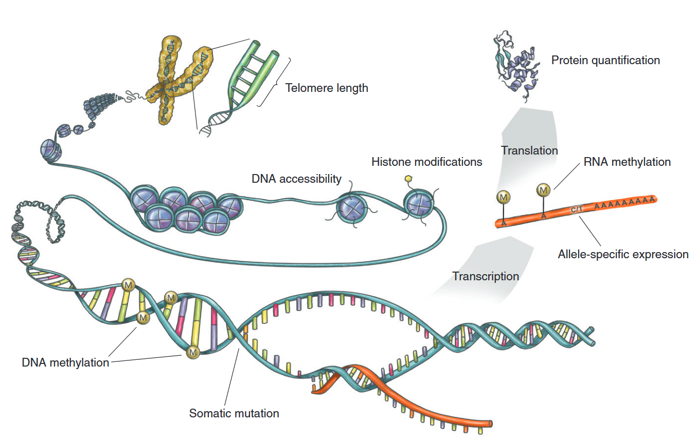

# OMICS4PLANT/TECHNOLOGY

*eGTEx Project (2017). Enhancing GTEx by bridging the gaps between genotype, gene expression, and disease. Nature genetics, 49(12), 1664–1670. https://doi.org/10.1038/ng.3969*

## 测序技术 

一代测序（sanger测序）

二代测序（短读长，NGS）

三代测序（长读长，TGS）

测序衍生技术：Hi-C，Pore-C，ATAC，Chip-seq

## single-cell

- sx: single-cell or single-nuclei
- scATAC-seq: single-cell assay for transposase-accessible chromation
- scRNA-seq: 
- surface proteins: (e.g., cellular indexing of transcriptomes and epitopes by sequencing (CITE-seq))
- What can be got form single-cell resolution?
  - discover novel cell types
  - better characterize known cell types
  - identify gene regulatory interactions and biomarkers
  - recover comprehensive immune repertoires
- droplet-based sequencing technologies
微流控技术

磁珠技术

## 空间组技术

原位杂交技术

