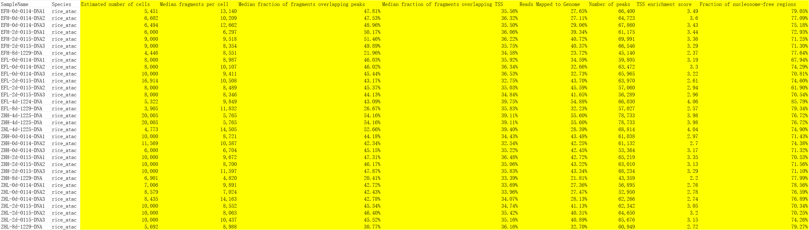
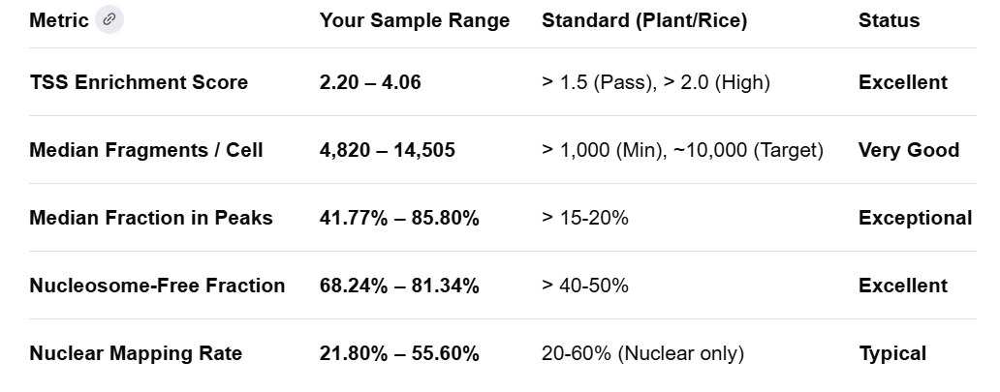

scATAC-seq_v3用户手册 https://cloud.stomics.tech/helpcenter/zh/tool/scATAC-seq_v3.html

Preparation `summary.png()`:
  - SampleName：样本名。
  - Species：物种。
  - Estimated number of cells：细胞数。(> 1,000 (Min), ~10,000 (Target))
  - Median fragments per cell：每个细胞的fragments。(> 15-20%)
  - Median fraction of fragments overlapping peaks：fragments覆盖于peak的比例。Fraction of Reads in Peaks (FRiP).
  - Median fraction of fragments overlapping TSS：fragment覆盖于TSS的比例。
  - Reads Mapped to Genome：比对到参考基因组的reads数/总测序的read数。(20-60% (Nuclear only))
  - Number of peaks：peak(特征)的数量。
  - TSS enrichment score：富集到转录起始位点的得分。(> 1.5 (Pass), > 2.0 (High))
  - Fraction of nucleosome-free regions：无核区域占总区域的比例。(> 40-50%)

> - Yan, H., Mendieta, J. P., Zhang, X., Marand, A. P., Liang, Y., Luo, Z., Minow, M. A. A., Jang, H., Li, X., Roule, T., Wagner, D., Tu, X., Wang, Y., Jiang, D., Zhong, S., Huang, L., Wessler, S. R., & Schmitz, R. J. (2024). Evolution of plant cell-type-specific cis-regulatory elements. bioRxiv : the preprint server for biology, 2024.01.08.574753. https://doi.org/10.1101/2024.01.08.574753
> - Dorrity, M. W., Alexandre, C. M., Hamm, M. O., Vigil, A. L., Fields, S., Queitsch, C., & Cuperus, J. T. (2021). The regulatory landscape of Arabidopsis thaliana roots at single-cell resolution. Nature communications, 12(1), 3334. https://doi.org/10.1038/s41467-021-23675-y
> - Yan, H., Mendieta, J. P., Zhang, X., Luo, Z., Marand, A. P., Liang, Y., Minow, M. A. A., Zhong, Y., Jin, Y., Jang, H., Li, X., Zhang, X., Roulé, T., Wagner, D., Tu, X., Wang, Y., Jiang, D., Zhong, S., Huang, L., Wessler, S. R., … Schmitz, R. J. (2025). A single-cell rice atlas integrates multi-species data to reveal cis-regulatory evolution. Nature plants, 11(10), 2050–2071. https://doi.org/10.1038/s41477-025-02106-6

Prompt words: Could you please help me estimate the quality of our scATAC-seq data? The sequenced species is [*Genus species*] and the sequenced tissue is [*leaf / root / seed*]. [`Paste metrics_summary.csv`]

