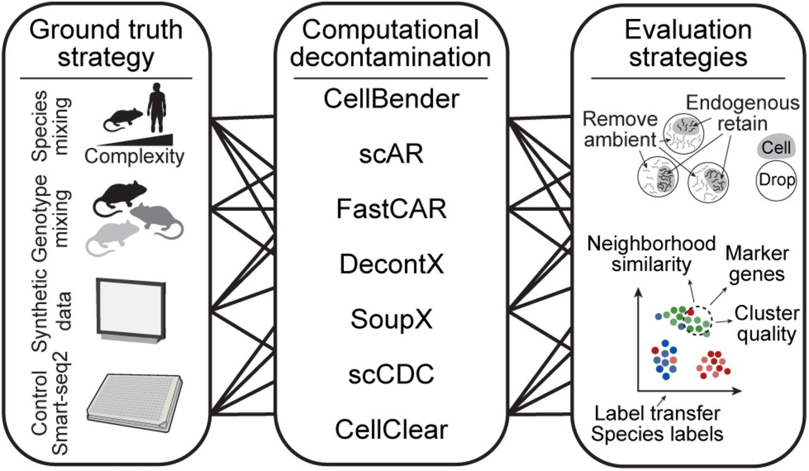
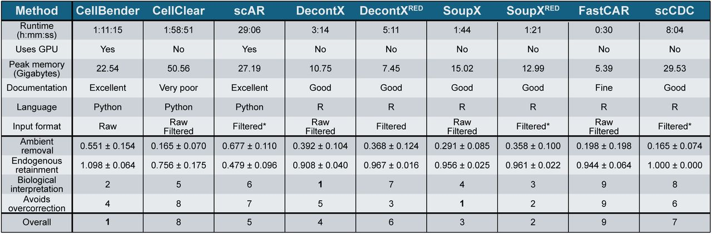
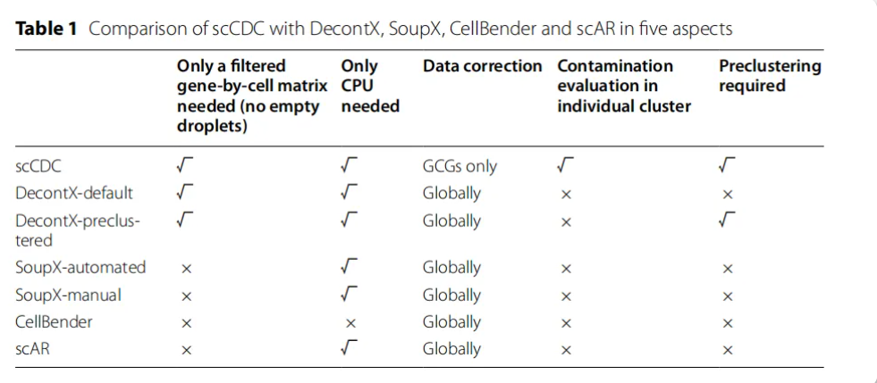

# Dataget: get anndata/seurat from matrix


## Dataget-SoupX
~~搭建一个多方法RNA去污染的R包，包括SoupX，decontx，scCDC和FastCAR。支持两种模式输入，一种模式包含raw和filter矩阵，一种是只有filter矩阵。另外附带一些数据统计和可视化方案，最终输出矫正后的矩阵和可视化。输入文件：1）raw+filter；2）filter。是否聚类：1）no 2）need。评估去污：1）ambient RNA的去除；2）生物学性状的保留：cluster、marker、annotation。横向对比：corrected与uncorrected的对比。~~

- Variables
  1. `rawMatrix` (Required, default to None) 原始表达矩阵
  2. `filterMatrix` (Required, default to None) 过滤后表达矩阵
  3. `prefix` (Required, default to None) 文件输出后缀
  4. `min_genes` (Required, default to 100) 过滤少于`min_genes`基因表达的细胞
  5. `min_cells` (Required, default to 3) 过滤少于在`min_cells`细胞表达的基因
  6. `tfidfMin` (Required, default to 1) Minimum value of tfidf to accept for a marker gene.
  7. `roundToInt` (Required, default to true) SoupX输出的矩阵为整数矩阵
  8. `mem_Decontamination` (Required, default to 32) 内存使用G
- Softwares
  - SoupX
  - ~~decontx~~
  - ~~scCDC~~
  - ~~FastCAR~~
- Output
- env
  ```shell
  source /opt/software/miniconda3/bin/activate
  conda config --add channels conda-forge
  conda create -n R4.3 r-base=4.3 -y
  conda activate R4.3
  conda install conda-forge::r-devtools -y
  conda install conda-forge::r-seurat -y
  conda install conda-forge::r-ddpcr -y
  conda install conda-forge::r-proc -y
  Rscript -e 'devtools::install_github("ZJU-UoE-CCW-LAB/scCDC")' # scCDC
  conda install bioconda::bioconductor-decontx -y # DecontX
  conda install conda-forge::r-soupx -y # SoupX
  Rscript -e 'devtools::install_git("https://git.web.rug.nl/P278949/FastCAR")' # FastCAR
  # devtools::install_github("immunogenomics/presto")
  conda install bioconda::bioconductor-dropletutils -y
  conda install conda-forge::r-optparse -y
  conda install conda-forge::r-reticulate -y
  conda install conda-forge::r-irkernel -y
  conda install bioconda::bioconductor-scdblfinder -y
  ```

  ```R
  lapply(c("Seurat","DropletUtils","SoupX", "optparse", "decontX", "FastCAR", "scCDC", "qlcMatrix", "Matrix", "scater"), library, character.only = T)
  ```





## Dataget-FilterDoublet
- Brief
- Variables
- Softwares
- Output
- env
```shell
# devtools::install_github("cellgeni/schard")
conda create -n py python=3.12 -y
conda activate py
conda install conda-forge::scanpy -y
conda install bioconda::scrublet -y
conda install conda-forge::leidenalg -y
```

## References
- [quality-control of best practice](https://www.sc-best-practices.org/preprocessing_visualization/quality_control.html#quality-control)
- Remove ambient
  - [*生信钱同学*·全代码干货奉上——多样本多方案去除单细胞环境RNA污染——这次把这个聊清楚](https://mp.weixin.qq.com/s/1eJq3u-aKpQaL9CM7bV94g)
  - [单细胞去噪工具一览](https://mp.weixin.qq.com/s/78RC4qH_Kw_eb-rql_QGjg)
  - [单细胞CellBender去除环境RNA污染学习(Python)](https://mp.weixin.qq.com/s/PZqwA1y2240JHkgw4D-UDQ)
  - [SoupX——去除RNA污染](https://mp.weixin.qq.com/s/7g9Zo6IPqTafSjKCeAFNIQ)
  - [使用DecontX预测和去除单细胞转录组的环境游离RNA污染](https://mp.weixin.qq.com/s/ndt9Fsgg5dNxIOh9m7j9Bw)
  - [是否细胞周期矫正，去除双细胞和环境RNA污染——单细胞入门到进阶(初级篇2）](https://mp.weixin.qq.com/s/HgTVwfDfE4lzBXJKihlknA)
- Remove doublet
  - [还在纠结双细胞质控方法吗！一文说清楚](https://mp.weixin.qq.com/s/64hB2cj-NwojuZbdiyEGzg)
  - [单细胞数据质控-双细胞预测-scrublet使用教程](https://mp.weixin.qq.com/s/EY4psNxQRIs0c-9OXhDUqA)