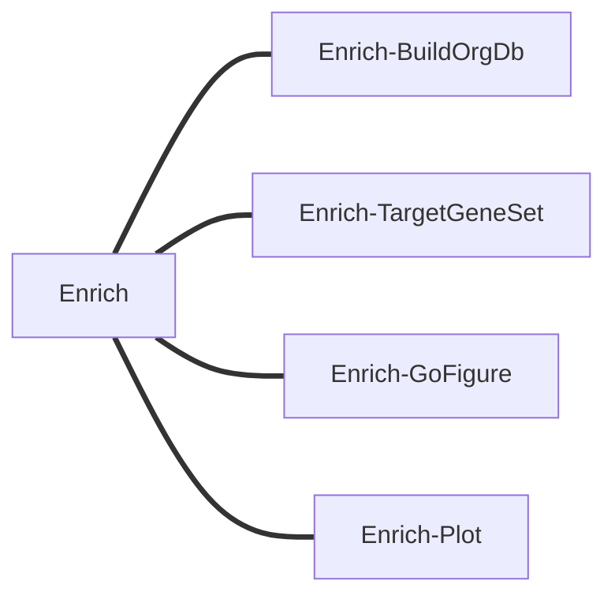

# 基因富集流程：Enrich

- Enrich-BuildOrgDb：搭建特异物种富集用的库/包
- Enrich-TargetGeneSet：对目标基因集中p_val_adj小于`minp`的基因做富集（csv文件，至少包含gene和p_val_adj列）
- Enrich-GoFigure：go-figure做可视化，使用量化的信息内容和语义相似性将具有相似功能的术语分组在一起
- Enrich-Plot：……，其它可视化方案



子任务分流程设置

可视化要做好一点
富集设置qvalueCutoff和pvalueCutoff为0.05，结果按p.dajust从小到大排序，然后对各个Ontology的p.dajust取前十小的条目进行柱状图可视化

## Enrich-eggNOGmapper

```shell
conda create -n eggnog -c conda-forge -c bioconda "eggnog-mapper>=2" python=3.10 diamond hmmer -y
conda activate eggnog
mkdir -p /data/db/eggnog-mapper
export EGGNOG_DATA_DIR=/data/db/eggnog-mapper
download_eggnog_data.py
gunzip eggnog.db.gz
gunzip eggnog_proteins.dmnd.gz
tar -zxvf eggnog.taxa.tar.gz
tar -zxvf mmseqs.tar.gz
tar -zxvf pfam.tar.gz
export EGGNOG_DATA_DIR=/data/db/eggnog-mapper
nohup emapper.py -i Gene_longest.pep.fa -o ./output --cpu 30 &


/opt/software/miniconda3/envs/eggnog/bin/emapper.py
```


## Enrich-BuildOrgDb

[eggnog-mapper](http://eggnog-mapper.embl.de/)

如何投递eggnog-mapper，或者使用galaxy的eggnog-mapper
云平台部署eggnog-mapper


- 本地配置eggNOG-mapper并且进行任意物种的功能注释 https://mp.weixin.qq.com/s/mJpRBwPKiKoq9MT77M8yQg


## Enrich-TargetGeneSet
先构建package，package构建好后输出.tar.gz，作为Enrich-TargetGeneSet的输入`dbTarGz`

单一csv和多个csv，多个csv应是缺乏cluster信息的，如果是多个csv，但是有cluster信息，我们需要将文件信息和原来的cluster做一个连接。

## Enrich-GoFigure
GO-Figure，这是一个开源 Python 软件，用于生成用户可定制的冗余减少的 GO 术语列表的`semantic space`语义相似性散点图。通过使用量化的信息内容和语义相似性将具有相似功能的术语分组在一起，并由用户控制分组阈值，可以简化列表。然后选择代表在二维语义空间中绘制，其中相似的术语在散点图上彼此更靠近，并具有一系列用户可定制的图形属性

- [go-figure](https://gitlab.com/evogenlab/GO-Figure)
- [enrichplot](https://github.com/YuLab-SMU/enrichplot)
- [test data of go-figure](https://gitlab.com/evogenlab/GO-Figure/-/tree/master/example_data?ref_type=heads)
- [usage of go-figure](https://gitlab.com/evogenlab/GO-Figure/-/wikis/Example-plots)
- [go-figure: 富集到的GO太多太繁怎么办？](https://mp.weixin.qq.com/s/9b6y7-URKaNkMVKDk5mmig)

- [告别“对着富集列表发呆”！clusterProfiler 引入 AI 多智能体，一键挖掘生物学故事](https://mp.weixin.qq.com/s/DdTjbdCSSRmgwH67aA2wSg) [en](https://yulab-smu.top/biomedical-knowledge-mining-book/interpretation.html)

## 富集结果解读
- ONTOLOGY: 本体类别，使用的基因功能分类体系。（BP: Biological Process; CC: Cellular Component; MF: Molecular Function; KEGG: KEGG通路; REACTOME: Reactome通路）
- ID: 标识符，功能条目的唯一标识符。GO:0006915（GO ID）；ko:K13511（KEGG ID）
- Description：描述，功能条目的文字描述。
- GeneRatio：**输入基因列表中**属于该功能的基因数/输入基因总数。值越大，说明该功能在输入基因中越富集。
- BgRatio：**背景基因集中**属于该功能的基因数 / 背景基因总数。作为比较基准，用于计算富集显著性。
- pvalue：富集显著性检验的原始P值。值越小，富集越显著。
- p.adjust：经过多重检验校正后的P值。通常用这个值判断显著性（而非原始pvalue）。
- qvalue：错误发现率（FDR）的估计值。越小越好。
- geneID：属于该功能的输入基因ID。具体的富集基因，通常用斜杠分隔。
- Count：输入基因列表中属于该功能的基因数量。富集到的基因数，值越大通常越重要。

- 高分文章中，GO/KEGG富集分析结果可以有至少8种展现形式 https://mp.weixin.qq.com/s/ULb2Si2kj1eRzs68eiAONg


环境搭建
[clusterprofiler安装-六种方法](https://mp.weixin.qq.com/s/BYydet8hoBdbfZQgdc2dIA)
```shell
conda create -n r r-base=4.2 -y
conda activate r
yum install libicu libicu-devel
conda install conda-forge::r-biocmanager -y
conda install bioconda::bioconductor-clusterprofiler -y
# BiocManager::install("clusterProfiler")
conda install conda-forge::r-tidyverse -y
conda install bioconda::bioconductor-annotationforge -y
```

gofigure的背景文件下载`ic.tsv`, `relations_full.tsv`, `go.obo` [gofigure rep](https://gitlab.com/evogenlab/GO-Figure/-/tree/master/data?ref_type=heads) [buidu cloud pwd:1111]()

# Reference
- [模式植物构建orgDb数据库 | 以org.Slycompersicum.eg.db为例](https://mp.weixin.qq.com/s/b8OrDKJJGdXwF9B1C7l6zg)
- [使用clusterProfiler对非模式植物进行注释](https://mp.weixin.qq.com/s/Mr3YLoc_-Y1WeLKJku1TzQ)
- [富集分析|非模式物种GO/KEGG注释不会做？全网最详细eggNOG-mapper构建OrgDb包用于GO和KEGG富集分析](https://mp.weixin.qq.com/s/3sRdRuz6o5XuG11e2cX7Kw)
- [生信干货 | AnnotationHub包-非模式物种OrgDB下载制作](https://mp.weixin.qq.com/s/auyTKJhfos0wi_yPsA7O0g)
- [超详细非模式物种GO数据库全新代码构建](https://mp.weixin.qq.com/s/b23itzn5RNT8mJ1Ok8RzzA)
- [非模式基因GO富集分析：以玉米为例+使用OrgDb](https://mp.weixin.qq.com/s/lHKZtzpN2k9uPN7e6HjH3w) 和[非模式物种做GO富集分析](https://mp.weixin.qq.com/s/MgOxWjpZlMvgVqwOa2XUAQ)使用`AnnotationHub`来获取Orgdb库
- [模式植物GO背景基因集制作](https://mp.weixin.qq.com/s/08hAZs24mi_KBOa4QZRLdQ)
- [从 gtf 文件构建 orgdb 和 txdb 数据库](https://mp.weixin.qq.com/s/w3FFimm-xF2OY20aoFRcSg)
- [基因id转换 数据分析中常用基因名转换的5种方法 - 生信大碗的文章 - 知乎](https://zhuanlan.zhihu.com/p/568379221)

**解决了之前要安装包才能调用库的问题**
```R 
orgdb <- loadDb("/data/work/0.peanut/orgdb/output/org.Ahypogaea.eg.db/inst/extdata/org.Ahypogaea.eg.sqlite") #加载本地数据库
keytypes(orgdb)  # 查看这个数据库中有哪几种keytypes
#  [1] "EVIDENCE"    "EVIDENCEALL" "GENENAME"    "GID"         "GO"         
#  [6] "GOALL"       "Ko"          "ONTOLOGY"    "ONTOLOGYALL" "Pathway"    
length(keys(orgdb)) #查看包含的基因数量
# [1] 68781
columns(orgdb)  #查看OrgDb对象的数据类型
#  [1] "EVIDENCE"    "EVIDENCEALL" "GENENAME"    "GID"         "GO"         
#  [6] "GOALL"       "Ko"          "ONTOLOGY"    "ONTOLOGYALL" "Pathway" 
saveDb(orgdb,file="/data/work/0.peanut/orgdb/output/Ahypogaea.Orgdb") #把Capra_hircus对象保存成Capra_hircus.OrgDb文件。
```

enrichplot可视化和gsea分析后续补上
