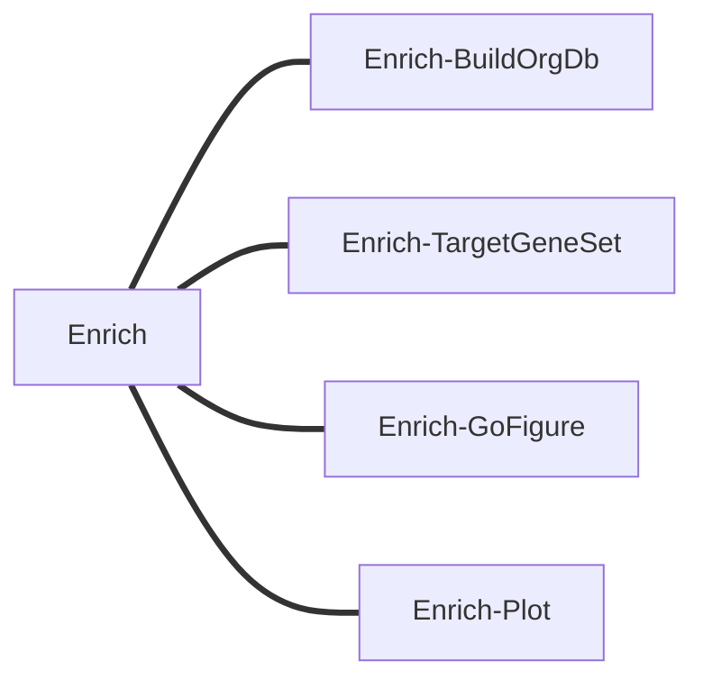

# 基因富集流程：Enrich

- Enrich-BuildOrgDb：搭建特异物种富集用的库/包
- Enrich-TargetGeneSet：对目标基因集中p_val_adj小于`minp`的基因做富集（csv文件，至少包含gene和p_val_adj列）
- Enrich-GoFigure：go-figure做可视化，使用量化的信息内容和语义相似性将具有相似功能的术语分组在一起
- Enrich-Plot：……，其它可视化方案

子任务分流程设置

可视化要做好一点
富集设置qvalueCutoff和pvalueCutoff为0.05，结果按p.dajust从小到大排序，然后对各个Ontology的p.dajust取前十小的条目进行柱状图可视化

# Enrich-TargetGeneSet
先构建package，package构建好后输出.tar.gz，作为Enrich-TargetGeneSet的输入`dbTarGz`

单一csv和多个csv，多个csv应是缺乏cluster信息的，如果是多个csv，但是有cluster信息，我们需要将文件信息和原来的cluster做一个连接。

# Enrich-GoFigure
GO-Figure，这是一个开源 Python 软件，用于生成用户可定制的冗余减少的 GO 术语列表的`semantic space`语义相似性散点图。通过使用量化的信息内容和语义相似性将具有相似功能的术语分组在一起，并由用户控制分组阈值，可以简化列表。然后选择代表在二维语义空间中绘制，其中相似的术语在散点图上彼此更靠近，并具有一系列用户可定制的图形属性

[go-figure](https://gitlab.com/evogenlab/GO-Figure)
[enrichplot](https://github.com/YuLab-SMU/enrichplot)
[test data of go-figure](https://gitlab.com/evogenlab/GO-Figure/-/tree/master/example_data?ref_type=heads)
[usage of go-figure](https://gitlab.com/evogenlab/GO-Figure/-/wikis/Example-plots)
[go-figure: 富集到的GO太多太繁怎么办？](https://mp.weixin.qq.com/s/9b6y7-URKaNkMVKDk5mmig)

富集结果解读
- ONTOLOGY: 本体类别，使用的基因功能分类体系。（BP: Biological Process; CC: Cellular Component; MF: Molecular Function; KEGG: KEGG通路; REACTOME: Reactome通路）
- ID: 标识符，功能条目的唯一标识符。GO:0006915（GO ID）；ko:K13511（KEGG ID）
- Description：描述，功能条目的文字描述。
- GeneRatio：**输入基因列表中**属于该功能的基因数/输入基因总数。值越大，说明该功能在输入基因中越富集。
- BgRatio：**背景基因集中**属于该功能的基因数 / 背景基因总数。作为比较基准，用于计算富集显著性。
- pvalue：富集显著性检验的原始P值。值越小，富集越显著。
- p.adjust：经过多重检验校正后的P值。通常用这个值判断显著性（而非原始pvalue）。
- qvalue：错误发现率（FDR）的估计值。越小越好。
- geneID：属于该功能的输入基因ID。具体的富集基因，通常用斜杠分隔。
- Count：输入基因列表中属于该功能的基因数量。富集到的基因数，值越大通常越重要。

- 高分文章中，GO/KEGG富集分析结果可以有至少8种展现形式 https://mp.weixin.qq.com/s/ULb2Si2kj1eRzs68eiAONg
