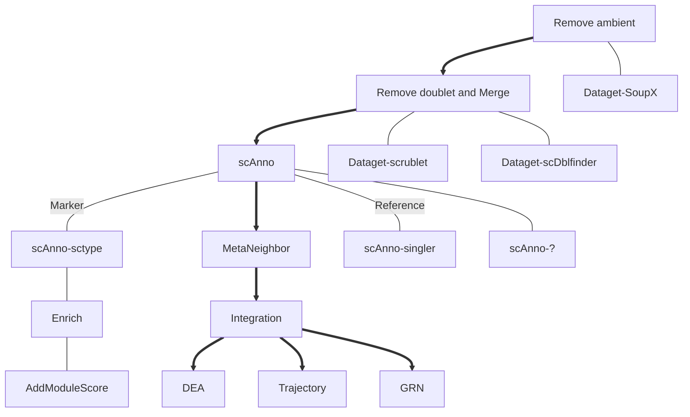

# WORKFLOW

---
## Available WDL
> 所有流程都搭建在**万种植物（时空）**和**作物多维组学_武汉（武汉1）**
- Dataget-FilterDoublet [readme](./Dataget/)
- Enrich [readme](./Enrich/)
  - Enrich-eggNOGmapper: 云平台eggNOG-mapper对序列做功能条目注释
  - Enrich-BuildOrgDb：搭建特异物种富集用的库/包
  - Enrich-TargetGeneSet：对目标基因集中p_val_adj小于`minp`的基因做富集（csv文件，至少包含gene和p_val_adj列）
- ATAC [readme](./ATAC/)
- remove_empty_droplet

<!-- ## [ydFormat](./ydFormat/)
> rds与h5ad文件的转换

## [Dataget](./Dataget/) :arrow_up: 

## [Cluster](./Cluster/) :arrow_up: 

---

## [MetaNeighbor](./MetaNeighbor/) :arrow_up: 

---

## [Annotation](./Annotation/) (optional)

---

## [Enrich](./Enrich/) (optional)

---

## [Integration](./Integration/)

---

## [DEA](./DEA/) :arrow_down: 

## [GRN](./GRN/) :arrow_down: 

## [CEA](./CEA/) :arrow_down: 

## [Trajectory](./Trajectory/) :arrow_down:  -->
