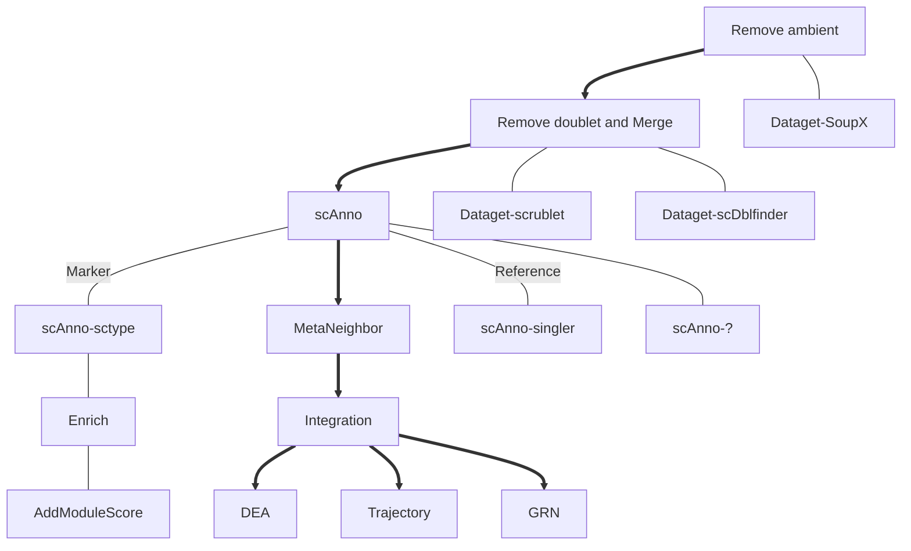

# WORKFLOW

---
## [ydFormat](./ydFormat/)
> rds与h5ad文件的转换

## [Dataget](./Dataget/) :arrow_up: 

## [Cluster](./Cluster/) :arrow_up: 

---

## [MetaNeighbor](./MetaNeighbor/) :arrow_up: 

---

## [Annotation](./Annotation/) (optional)

---

## [Enrich](./Enrich/) (optional)

---

## [Integration](./Integration/)

---

## [DEA](./DEA/) :arrow_down: 

## [GRN](./GRN/) :arrow_down: 

## [CEA](./CEA/) :arrow_down: 

## [Trajectory](./Trajectory/) :arrow_down: 
